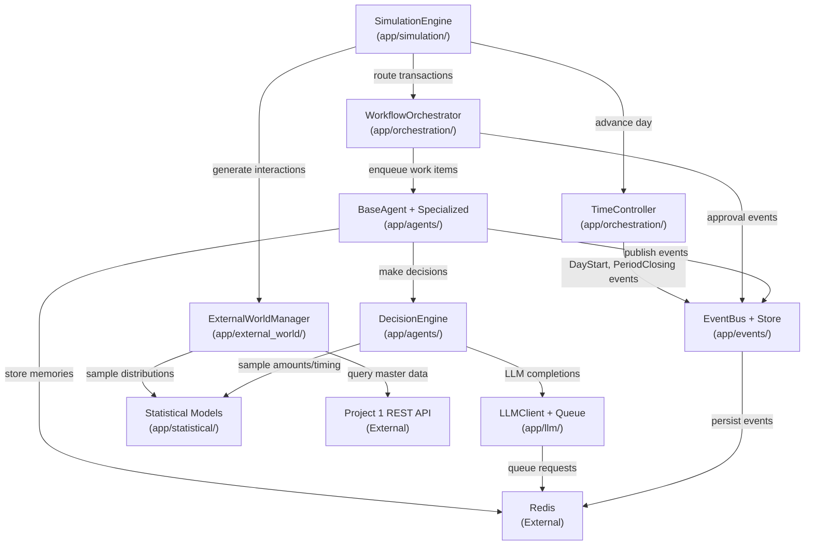

# Technical Specification

# 0. Agent Action Plan

## 0.1 Intent Clarification

### 0.1.1 Core Feature Objective

Based on the prompt, the Blitzy platform understands that the new feature requirement is to **build a complete AI-powered Agent & Orchestration Engine** (Project 2 of the Synthetic ERP Data Generation Platform) from an empty repository, implementing seven interconnected subsystems that simulate realistic ERP employee behavior through autonomous, memory-equipped, LLM-augmented agents.

The core feature requirements, restated with enhanced clarity, are:

- **F-001 — Agent System**: Create an abstract `BaseAgent` framework with personality traits (thoroughness, risk_tolerance, efficiency, compliance — each 0.0 to 1.0), dual-stream memory (observation stream: max 1,000 entries; reflection stream: max 100 entries with semantic retrieval via `all-MiniLM-L6-v2`), a 14-action registry spanning procurement, AP, AR, and accounting functions, and 12 specialized agent subclasses across six ERP functional areas (AP, AR, Purchasing, Warehouse, Accounting, Financial Control)
- **F-002 — LLM Integration**: Implement a unified `LLMClient` supporting Anthropic (Claude Sonnet 4, Claude Haiku 4), OpenAI (GPT-4 Turbo, GPT-3.5 Turbo), and Azure OpenAI, with a `PromptManager` (6 YAML-based template types, ~1,500 token context budget), `LLMQueue` (Redis Streams with XADD/XREADGROUP, batch size 10, priority levels), `LLMMonitor` (cost tracking, latency alerts), and hard budget cap of $100/month
- **F-003 — Workflow Orchestration**: Build a `WorkflowOrchestrator` that maps transaction types to agent roles, a `TransactionOrchestrator` that tracks required artifacts per transaction type, and an `ApprovalSystem` enforcing monetary thresholds (e.g., PO > $100K requires CFO approval)
- **F-004 — Time Controller**: Develop a `TimeController` with `BusinessCalendar` (US Federal holidays 2024–2026, 8AM–5PM working hours, lunch break) and `FiscalCalendar` (configurable fiscal year start, monthly/quarterly periods, open→closing→closed lifecycle)
- **F-005 — External World Simulation**: Implement an `ExternalWorldManager` with tiered entity pools (Strategic 10%, Standard 30%, Transactional 60%), `BehaviorProfile` definitions for payment, order, and invoice dimensions, and simulators for customers, vendors, banks, and carriers
- **F-006 — Statistical Models**: Create distribution models for amounts (log-normal, min $100, max $500K), payment timing (5-segment mixture model with Normal and LogNormal distributions), order frequency (Poisson with day-of-week effects), and entity selection (Pareto 80/20 weighted by spend history)
- **F-007 — Event System**: Build a dual-mode `EventBus` (in-memory asyncio.Queue for <500 events/sec, optional Redis Pub/Sub for >5,000 events/sec), `EventStore` with JSONB persistence, 8 defined event types, and event replay for state reconstruction

**Implicit requirements detected:**

- A top-level `SimulationEngine` (the main loop) is required to orchestrate daily processing across all subsystems, though it is not assigned a standalone feature ID
- A `DayContext` data structure is needed to pass daily simulation state between subsystems
- `SimulationMetrics` for end-to-end performance tracking must be implemented
- An `AgentRegistry` class is needed for centralized agent instance management
- `WorkItem`, `WorkResult`, and `WorkflowInstance` data classes must be created as the work-processing contract between orchestration and agents
- Configuration YAML files must be created for agent roles, approval thresholds, statistical parameters, and LLM settings
- YAML prompt templates (6 templates) must be authored for each LLM decision type
- Pydantic V2 models are required at all subsystem boundaries for input/output validation

### 0.1.2 Special Instructions and Constraints

**Architectural Directives:**

- Integrate with Project 1's existing REST API for all master data access — no direct database connections to upstream systems
- Use Project 1's existing authentication system without modification (`README.md`, line 703)
- Maintain read-only access pattern for all Project 1 interactions
- All logging must use `structlog` to stdout only — no Prometheus, Grafana, or APM integration
- The system must operate as a pure application-logic layer — no Docker, Kubernetes, Helm charts, or CI/CD pipelines

**Performance Constraints:**

- Agent creation: ≥ 50 agents/second
- Decision latency: p95 < 5 seconds
- Agent concurrency: ≥ 20 simultaneous agents
- Workflow routing: < 500 milliseconds
- Concurrent workflows: ≥ 100
- LLM latency: < 3 seconds average
- LLM cost: < $100/month
- Business day advancement: < 30 seconds
- Monthly generation (2,000 transactions): 4–8 hours

**Timeout Constraints (from specification table):**

- Agent work item (simple decision): 10 seconds
- Agent work item (LLM decision): 30 seconds
- Agent work item (complex workflow): 60 seconds
- Agent work item (absolute max): 120 seconds
- Memory add observation: 1 second
- Memory retrieve relevant: 2 seconds
- Event publish: 1 second
- LLM completion request: 30 seconds

**Budget Controls:**

- Monthly budget: $100 USD
- Warning threshold: 80% ($80)
- Block threshold: 100% ($100)
- Rate limits: Claude Sonnet 4 at 50 req/min, Claude Haiku 4 at 100 req/min

**Memory Constraints:**

- Max 1,000 observations per agent (~500 bytes each)
- Max 100 reflections per agent (~2 KB each)
- Total memory per agent: ~700 KB
- Max total agents: 50
- Redis: 2 GB max with `allkeys-lru` eviction
- LLM queue max size: 1,000 pending requests

### 0.1.3 Technical Interpretation

These feature requirements translate to the following technical implementation strategy:

- To **implement the Agent System (F-001)**, we will create the `app/agents/` module with `BaseAgent` (abstract class with async `run()` loop and `process_work_item()` contract), `AgentConfig` (Pydantic V2 model with trait definitions), `AgentState` (str Enum), `AgentMemory` (dual-stream with sentence-transformer embeddings), `ActionRegistry` (14 registered action types), `DecisionEngine` (4-layer hybrid: Statistical → LLM → Validation → Deterministic), and 12 specialized agent classes under `app/agents/specialized/`
- To **implement LLM Integration (F-002)**, we will create the `app/llm/` module with `LLMClient` (unified async client wrapping `anthropic.AsyncAnthropic` and `openai.AsyncOpenAI`), `LLMQueue` (Redis Streams-backed with consumer groups), `LLMMonitor` (metrics tracking and alerting), `PromptManager` (YAML template loader with context assembly), and `ResponseParser` (structured JSON extraction from LLM output)
- To **implement Workflow Orchestration (F-003)**, we will create `app/orchestration/workflow_orchestrator.py` (transaction-to-agent routing with queue-depth-based selection), `app/orchestration/approval_system.py` (threshold-based approval chains), and `app/orchestration/transaction_orchestrator.py` (artifact completeness tracking)
- To **implement the Time Controller (F-004)**, we will create `app/orchestration/time_controller.py`, `app/orchestration/business_calendar.py` (US holidays via `holidays` library), and `app/orchestration/fiscal_calendar.py` (configurable periods with lifecycle management)
- To **implement External World Simulation (F-005)**, we will create `app/external_world/` with `ExternalWorldManager` (tiered entity pools), `BehaviorProfile` (multi-dimensional behavioral configuration), and simulators for customers, vendors, and banks
- To **implement Statistical Models (F-006)**, we will create `app/statistical/` with `AmountDistribution` (log-normal), `PaymentTimingModel` (5-segment mixture), `OrderFrequencyModel` (Poisson with day-of-week effects), and `SelectionModel` (Pareto 80/20)
- To **implement the Event System (F-007)**, we will create `app/events/` with `EventBus` (dual-mode async pub/sub), `EventStore` (JSONB persistence with UUID-indexed queries), and 8 event type definitions
- To **implement the Simulation Engine**, we will create `app/simulation/simulation_engine.py` (main loop driving TimeController → EventBus → ExternalWorld → Agents daily cycle), `app/simulation/day_context.py`, and `app/simulation/simulation_metrics.py`

## 0.2 Repository Scope Discovery

### 0.2.1 Comprehensive File Analysis

The repository is currently **empty** aside from `README.md` (2,349 lines), which serves as the single source-of-truth specification for the entire Project 2 implementation. Since this is a greenfield build, all files listed below must be **created** from scratch, following the module structure defined in the specification (`README.md`, lines 2146–2246).

**Existing files (repository baseline):**

| File Path | Purpose | Action Required |
|-----------|---------|-----------------|
| `README.md` | Project specification (2,349 lines) | Preserve as-is; reference for implementation |

**Target module hierarchy to create (from specification, `README.md` lines 2146–2246):**

```
synthetic_erp_platform/
├── app/
│   ├── __init__.py
│   ├── agents/
│   │   ├── __init__.py
│   │   ├── base_agent.py
│   │   ├── agent_config.py
│   │   ├── agent_memory.py
│   │   ├── agent_registry.py
│   │   ├── action_registry.py
│   │   ├── decision_engine.py
│   │   └── specialized/
│   │       ├── __init__.py
│   │       ├── ap_clerk_agent.py
│   │       ├── ap_manager_agent.py
│   │       ├── ar_clerk_agent.py
│   │       ├── ar_manager_agent.py
│   │       ├── purchasing_agent.py
│   │       ├── purchasing_manager_agent.py
│   │       ├── warehouse_clerk_agent.py
│   │       ├── warehouse_manager_agent.py
│   │       ├── accountant_agent.py
│   │       ├── senior_accountant_agent.py
│   │       ├── controller_agent.py
│   │       └── cfo_agent.py
│   ├── llm/
│   │   ├── __init__.py
│   │   ├── llm_client.py
│   │   ├── llm_config.py
│   │   ├── llm_queue.py
│   │   ├── llm_monitor.py
│   │   ├── prompt_manager.py
│   │   └── response_parser.py
│   ├── orchestration/
│   │   ├── __init__.py
│   │   ├── workflow_orchestrator.py
│   │   ├── transaction_orchestrator.py
│   │   ├── approval_system.py
│   │   ├── time_controller.py
│   │   ├── business_calendar.py
│   │   └── fiscal_calendar.py
│   ├── external_world/
│   │   ├── __init__.py
│   │   ├── external_entity_manager.py
│   │   ├── behavior_profiles.py
│   │   ├── customer_simulator.py
│   │   ├── vendor_simulator.py
│   │   └── bank_simulator.py
│   ├── statistical/
│   │   ├── __init__.py
│   │   ├── amount_distributions.py
│   │   ├── timing_models.py
│   │   ├── payment_timing_model.py
│   │   ├── order_frequency_model.py
│   │   └── selection_models.py
│   ├── events/
│   │   ├── __init__.py
│   │   ├── event_bus.py
│   │   ├── event_store.py
│   │   ├── event_types.py
│   │   └── event_handlers.py
│   └── simulation/
│       ├── __init__.py
│       ├── simulation_engine.py
│       ├── day_context.py
│       └── simulation_metrics.py
├── prompts/
│   ├── process_vendor_invoice.yaml
│   ├── approve_transaction.yaml
│   ├── match_documents.yaml
│   ├── handle_exception.yaml
│   ├── generate_description.yaml
│   └── reconcile_account.yaml
├── config/
│   ├── agents/
│   │   └── agent_roles.yaml
│   ├── workflows/
│   │   └── approval_thresholds.yaml
│   ├── statistical/
│   │   ├── payment_timing.yaml
│   │   └── amount_distributions.yaml
│   └── llm/
│       └── llm_config.yaml
└── tests/
    ├── __init__.py
    ├── conftest.py
    ├── test_agents/
    │   ├── __init__.py
    │   ├── test_base_agent.py
    │   ├── test_agent_memory.py
    │   ├── test_agent_config.py
    │   ├── test_decision_engine.py
    │   ├── test_action_registry.py
    │   └── test_specialized_agents.py
    ├── test_llm/
    │   ├── __init__.py
    │   ├── test_llm_client.py
    │   ├── test_prompt_manager.py
    │   ├── test_llm_queue.py
    │   ├── test_llm_monitor.py
    │   └── test_response_parser.py
    ├── test_orchestration/
    │   ├── __init__.py
    │   ├── test_workflow_orchestrator.py
    │   ├── test_approval_system.py
    │   ├── test_transaction_orchestrator.py
    │   └── test_time_controller.py
    ├── test_external_world/
    │   ├── __init__.py
    │   ├── test_external_entity_manager.py
    │   ├── test_behavior_profiles.py
    │   └── test_simulators.py
    ├── test_statistical/
    │   ├── __init__.py
    │   ├── test_payment_timing_model.py
    │   ├── test_amount_distributions.py
    │   ├── test_order_frequency_model.py
    │   └── test_selection_models.py
    ├── test_events/
    │   ├── __init__.py
    │   ├── test_event_bus.py
    │   └── test_event_store.py
    └── test_simulation/
        ├── __init__.py
        └── test_simulation_engine.py
```

**Integration point discovery:**

Since this is a greenfield project, the integration points are exclusively **outward-facing** toward Project 1's existing infrastructure:

| Integration Point | Direction | Protocol | Files Involved |
|-------------------|-----------|----------|----------------|
| Project 1 REST API — Master Data | Outbound (read-only) | HTTP/REST via `aiohttp` | `app/agents/agent_registry.py`, `app/external_world/external_entity_manager.py` |
| Project 1 Configuration System | Inbound (load at startup) | YAML/JSON files | `config/**/*.yaml`, `app/llm/llm_config.py` |
| Project 1 Validation Framework | Shared library | Pydantic V2 models | All `app/**/*.py` modules |
| Anthropic Claude API | Outbound | HTTPS via `anthropic` SDK | `app/llm/llm_client.py` |
| OpenAI / Azure OpenAI API | Outbound | HTTPS via `openai` SDK | `app/llm/llm_client.py` |
| Redis | Bidirectional | Redis protocol | `app/llm/llm_queue.py`, `app/events/event_store.py`, `app/agents/agent_memory.py` |

### 0.2.2 Web Search Research Conducted

Research was conducted on the following topics to inform the implementation plan:

- **Best practices for async agent-based simulation systems in Python**: Confirmed asyncio event loop with `asyncio.Queue` for agent work queues and in-process event bus as the recommended pattern for sub-500 events/sec workloads
- **LLM provider SDK versions and async client interfaces**: Verified `anthropic>=0.79.0` supports `AsyncAnthropic` and `openai>=2.20.0` supports `AsyncOpenAI` with the required message/completion interfaces
- **Sentence-transformer `all-MiniLM-L6-v2` embedding dimensions and memory footprint**: Confirmed 384-dimensional embeddings, lightweight for local inference
- **SciPy statistical distribution parameterization**: Confirmed `scipy.stats.lognorm`, `scipy.stats.norm`, and Pareto distribution APIs match the specification's parameterization
- **Redis Streams consumer group patterns**: Confirmed XADD/XREADGROUP pattern for LLM queue with consumer groups aligns with Redis 7.x capabilities

### 0.2.3 New File Requirements

**New source files to create (63 files across 8 modules):**

| Module | Files | Purpose |
|--------|-------|---------|
| `app/agents/` | `base_agent.py`, `agent_config.py`, `agent_memory.py`, `agent_registry.py`, `action_registry.py`, `decision_engine.py` | Core agent framework, configuration, memory, and decision logic |
| `app/agents/specialized/` | 12 agent files (`ap_clerk_agent.py` through `cfo_agent.py`) | Specialized ERP role implementations |
| `app/llm/` | `llm_client.py`, `llm_config.py`, `llm_queue.py`, `llm_monitor.py`, `prompt_manager.py`, `response_parser.py` | LLM integration, queuing, monitoring, and prompt management |
| `app/orchestration/` | `workflow_orchestrator.py`, `transaction_orchestrator.py`, `approval_system.py`, `time_controller.py`, `business_calendar.py`, `fiscal_calendar.py` | Workflow routing, approval chains, and time management |
| `app/external_world/` | `external_entity_manager.py`, `behavior_profiles.py`, `customer_simulator.py`, `vendor_simulator.py`, `bank_simulator.py` | External entity simulation with tiered behavior profiles |
| `app/statistical/` | `amount_distributions.py`, `timing_models.py`, `payment_timing_model.py`, `order_frequency_model.py`, `selection_models.py` | Statistical distribution models |
| `app/events/` | `event_bus.py`, `event_store.py`, `event_types.py`, `event_handlers.py` | Event-driven coordination and persistence |
| `app/simulation/` | `simulation_engine.py`, `day_context.py`, `simulation_metrics.py` | Main simulation loop and metrics |

**New prompt template files (6 YAML templates):**

| File Path | Decision Type | Token Budget |
|-----------|--------------|--------------|
| `prompts/process_vendor_invoice.yaml` | Invoice processing with 3-way match | ~1,500 tokens |
| `prompts/approve_transaction.yaml` | Approval decisions with reasoning | ~1,500 tokens |
| `prompts/match_documents.yaml` | Document matching and reconciliation | ~1,500 tokens |
| `prompts/handle_exception.yaml` | Edge-case and exception handling | ~1,500 tokens |
| `prompts/generate_description.yaml` | Natural-language description generation | ~1,500 tokens |
| `prompts/reconcile_account.yaml` | Account reconciliation decisions | ~1,500 tokens |

**New configuration files (5 YAML configs):**

| File Path | Purpose |
|-----------|---------|
| `config/agents/agent_roles.yaml` | 12 agent role definitions with trait ranges |
| `config/workflows/approval_thresholds.yaml` | Monetary thresholds for PO, invoice, and JE approvals |
| `config/statistical/payment_timing.yaml` | 5-segment mixture model parameters |
| `config/statistical/amount_distributions.yaml` | Log-normal and sizing distribution parameters |
| `config/llm/llm_config.yaml` | Provider, model, fallback, rate limits, budget |

**New test files (22 test modules):**

| Test Module | Coverage Target |
|-------------|-----------------|
| `tests/test_agents/test_base_agent.py` | BaseAgent lifecycle, work queue, state transitions |
| `tests/test_agents/test_agent_memory.py` | Dual-stream memory, semantic retrieval, cleanup |
| `tests/test_agents/test_agent_config.py` | AgentConfig validation, trait boundaries |
| `tests/test_agents/test_decision_engine.py` | 4-layer decision pipeline, fallback logic |
| `tests/test_agents/test_action_registry.py` | Action registration, validation rules |
| `tests/test_agents/test_specialized_agents.py` | All 12 specialized agent types |
| `tests/test_llm/test_llm_client.py` | Provider abstraction, retry, fallback (mocked) |
| `tests/test_llm/test_prompt_manager.py` | Template loading, context assembly, token estimation |
| `tests/test_llm/test_llm_queue.py` | Redis Streams enqueue/dequeue, priority, batch |
| `tests/test_llm/test_llm_monitor.py` | Metrics tracking, budget alerts |
| `tests/test_llm/test_response_parser.py` | JSON extraction, schema validation |
| `tests/test_orchestration/test_workflow_orchestrator.py` | Transaction routing, agent selection |
| `tests/test_orchestration/test_approval_system.py` | Threshold enforcement, escalation chains |
| `tests/test_orchestration/test_transaction_orchestrator.py` | Artifact tracking, completeness checks |
| `tests/test_orchestration/test_time_controller.py` | Calendar advancement, holiday skipping |
| `tests/test_external_world/test_external_entity_manager.py` | Tiered entity pool management |
| `tests/test_external_world/test_behavior_profiles.py` | Profile assignment and behavioral parameters |
| `tests/test_external_world/test_simulators.py` | Customer, vendor, bank simulation logic |
| `tests/test_statistical/test_payment_timing_model.py` | 5-segment mixture, profile-weighted selection |
| `tests/test_statistical/test_amount_distributions.py` | Log-normal sampling, rounding, discount |
| `tests/test_statistical/test_order_frequency_model.py` | Poisson with day-of-week multipliers |
| `tests/test_statistical/test_selection_models.py` | Pareto vendor selection, revenue-weighted customer |
| `tests/test_events/test_event_bus.py` | Pub/sub, priority handling, dual-mode |
| `tests/test_events/test_event_store.py` | Event persistence, query, replay |
| `tests/test_simulation/test_simulation_engine.py` | Daily loop, subsystem coordination |

**Project root files to create:**

| File Path | Purpose |
|-----------|---------|
| `pyproject.toml` | Project metadata, dependencies, build configuration |
| `requirements.txt` | Pinned dependency versions |
| `.env.example` | Template for environment variables (LLM_PROVIDER, LLM_API_KEY, etc.) |
| `pytest.ini` or `setup.cfg` | Test configuration |

## 0.3 Dependency Inventory

### 0.3.1 Private and Public Packages

All packages listed below are public and sourced from the Python Package Index (PyPI). No private packages are required. Versions were verified by installing into a Python 3.11 virtual environment and cross-referencing with the specification (`README.md`, lines 710–727) and the tech spec sections on frameworks and libraries.

| Registry | Package Name | Version | Purpose |
|----------|-------------|---------|---------|
| PyPI | `anthropic` | >=0.79.0 | Anthropic Claude API async client (`AsyncAnthropic`) for LLM completions |
| PyPI | `openai` | >=2.20.0 | OpenAI / Azure OpenAI async client (`AsyncOpenAI`) for LLM completions |
| PyPI | `aiohttp` | >=3.9.0 | Async HTTP client for Project 1 REST API integration |
| PyPI | `redis` | >=7.0.0 | Redis client for caching, LLM queue (Streams), event store, agent state |
| PyPI | `numpy` | >=1.26.0 | Array operations, random state seeding for reproducible simulations |
| PyPI | `scipy` | >=1.12.0 | Statistical distributions: lognorm, norm, poisson, pareto via `scipy.stats` |
| PyPI | `faker` | >=22.0.0 | Synthetic data generation with custom ERP providers |
| PyPI | `pydantic` | >=2.5.0 | Data validation at all subsystem boundaries (V2 with `BaseModel`) |
| PyPI | `structlog` | >=24.1.0 | Structured JSON logging to stdout |
| PyPI | `python-dateutil` | >=2.8.0 | Date arithmetic, relative deltas for business calendar operations |
| PyPI | `holidays` | >=0.40 | US Federal holiday calendar (2024–2026) |
| PyPI | `tenacity` | >=8.2.0 | Retry with exponential backoff for LLM API calls |
| PyPI | `sentence-transformers` | >=2.3.0 | Local `all-MiniLM-L6-v2` embeddings for agent memory semantic retrieval |

**Development and testing dependencies:**

| Registry | Package Name | Version | Purpose |
|----------|-------------|---------|---------|
| PyPI | `pytest` | >=8.0.0 | Test framework |
| PyPI | `pytest-asyncio` | >=0.23.0 | Async test support for asyncio-based components |
| PyPI | `pytest-cov` | >=4.1.0 | Coverage reporting (target ≥80%) |
| PyPI | `fakeredis` | >=2.21.0 | In-memory Redis mock for unit tests |
| PyPI | `aioresponses` | >=0.7.6 | Mocking aiohttp requests for integration tests |

### 0.3.2 Dependency Updates

Since this is a greenfield project with an empty repository, there are no existing imports to update. All import structures will be created fresh following the module hierarchy defined in the specification.

**Import conventions to establish across all modules:**

- Internal cross-module imports use relative paths within `app/`:
  - `from app.agents.base_agent import BaseAgent`
  - `from app.llm.llm_client import LLMClient`
  - `from app.events.event_bus import EventBus`
- External library imports follow standard Python conventions:
  - `import asyncio`
  - `from scipy import stats`
  - `import numpy as np`
- Pydantic models are imported for all data contracts:
  - `from pydantic import BaseModel, Field, validator`

**Configuration files to create:**

| File | Format | Contents |
|------|--------|----------|
| `pyproject.toml` | TOML | Project metadata, dependency specifications, build system, pytest config |
| `requirements.txt` | Plain text | Pinned versions of all production dependencies |
| `requirements-dev.txt` | Plain text | Development and testing dependencies |
| `.env.example` | Environment template | LLM_PROVIDER, LLM_MODEL, LLM_FALLBACK_MODEL, LLM_API_KEY, LLM_MAX_TOKENS, LLM_TEMPERATURE, REDIS_URL |

**Environment variables required (from `README.md`, lines 183–189):**

| Variable | Type | Description |
|----------|------|-------------|
| `LLM_PROVIDER` | str | LLM provider selection: "anthropic", "openai", "azure_openai" |
| `LLM_MODEL` | str | Primary model identifier (e.g., "claude-sonnet-4-20250514") |
| `LLM_FALLBACK_MODEL` | str | Fallback model identifier (e.g., "claude-haiku-4-20250514") |
| `LLM_API_KEY` | str | Provider API key (never logged or serialized) |
| `LLM_MAX_TOKENS` | int | Maximum tokens per completion (default: 1000) |
| `LLM_TEMPERATURE` | float | Sampling temperature (default: 0.7) |
| `REDIS_URL` | str | Redis connection URL for caching, queuing, and persistence |

## 0.4 Integration Analysis

### 0.4.1 Existing Code Touchpoints

Since this is a greenfield project being built into an empty repository, there are no existing source files to modify. However, the system has critical **external integration touchpoints** with Project 1's infrastructure and external LLM APIs that must be precisely implemented. All integration contracts are documented in the specification (`README.md`, lines 2108–2141).

**Project 1 REST API Integration Points:**

| Integration | Module | Method | Data Consumed |
|-------------|--------|--------|---------------|
| Master data: customers | `app/external_world/external_entity_manager.py` | `aiohttp` GET requests | Customer records (IDs, names, tiers, payment terms) |
| Master data: vendors | `app/external_world/external_entity_manager.py` | `aiohttp` GET requests | Vendor records (IDs, names, categories, spend history) |
| Master data: products | `app/external_world/customer_simulator.py` | `aiohttp` GET requests | Product catalog for order generation |
| Master data: employees | `app/agents/agent_registry.py` | `aiohttp` GET requests | Employee records for agent-to-employee binding |
| Configuration | `config/**/*.yaml` | Loaded at startup | Approval thresholds, agent role definitions |
| Validation schemas | All `app/**/*.py` modules | Pydantic V2 models | Input/output validation at subsystem boundaries |

**Redis Integration Points:**

| Component | Redis Feature | Key Pattern | TTL |
|-----------|--------------|-------------|-----|
| `app/agents/agent_memory.py` | Key-Value (SET/GET) | `agent:{agent_id}:observations`, `agent:{agent_id}:reflections` | 30 days |
| `app/agents/agent_registry.py` | Key-Value (SET/GET) | `agent:{agent_id}:state` | 24 hours |
| `app/llm/llm_queue.py` | Streams (XADD/XREADGROUP) | Stream: `llm_requests`, Consumer group: `llm_workers` | 1 hour |
| `app/events/event_store.py` | Key-Value with JSONB | `event:{event_id}` | 7 days |
| `app/events/event_bus.py` | Pub/Sub (optional) | Channel: `events:{event_type}` | N/A (transient) |

**LLM Provider API Integration Points:**

| Provider | SDK Method | Module | Retry Strategy |
|----------|-----------|--------|----------------|
| Anthropic | `client.messages.create()` | `app/llm/llm_client.py` → `_complete_anthropic()` | 3 retries via tenacity (2s, 4s, 10s) + fallback to cheaper model |
| OpenAI | `client.chat.completions.create()` | `app/llm/llm_client.py` → `_complete_openai()` | 3 retries via tenacity (2s, 4s, 10s) + fallback to cheaper model |
| Circuit Breaker | Opens after 5 consecutive failures | `app/llm/llm_queue.py` | Auto-close after cooldown period |

### 0.4.2 Internal Cross-Module Integration Map

The following diagram illustrates how the seven subsystems interconnect within the engine. Each arrow represents a direct method call, queue enqueue, or event publication:



### 0.4.3 Dependency Injection Wiring

All subsystems will be wired through constructor injection in the `SimulationEngine`, which acts as the composition root. The injection hierarchy is:

| Component | Injected Dependencies |
|-----------|----------------------|
| `SimulationEngine` | `TimeController`, `ExternalWorldManager`, `WorkflowOrchestrator`, `EventBus`, `SimulationMetrics` |
| `WorkflowOrchestrator` | `AgentRegistry`, `ApprovalSystem`, `WorkflowConfig` |
| `ApprovalSystem` | `AgentRegistry`, `EventBus` |
| `AgentRegistry` | `DecisionEngine`, `AgentMemory` (factory), `ActionRegistry` |
| `DecisionEngine` | `LLMClient`, `PromptManager`, `StatisticalModels`, `ResponseParser` |
| `LLMClient` | `LLMConfig`, `LLMQueue`, `LLMMonitor`, `LLMBudgetManager`, `LLMRateLimiter` |
| `ExternalWorldManager` | `StatisticalModels`, `BehaviorProfile` (factory), `EventBus` |
| `EventBus` | `EventStore` (optional, for persistence) |
| `EventStore` | Redis client |

### 0.4.4 Database and Schema Updates

Project 2 does **not** create or modify any database schemas. All persistent state is managed through Redis with TTL-based lifecycle management. The schema for Redis key structures is defined as follows:

| Key Pattern | Value Type | Module |
|-------------|-----------|--------|
| `agent:{uuid}:state` | JSON (AgentState serialization) | `app/agents/agent_registry.py` |
| `agent:{uuid}:observations` | JSON list (max 1,000 entries) | `app/agents/agent_memory.py` |
| `agent:{uuid}:reflections` | JSON list (max 100 entries) | `app/agents/agent_memory.py` |
| `agent:{uuid}:embeddings` | Binary (384-dim float32 arrays) | `app/agents/agent_memory.py` |
| `event:{uuid}` | JSONB (event payload) | `app/events/event_store.py` |
| `simulation:{uuid}:metrics` | JSON (metrics snapshot) | `app/simulation/simulation_metrics.py` |
| `llm_requests` (Stream) | Stream entries (prompt, metadata) | `app/llm/llm_queue.py` |
| `llm:budget:{month}` | Float (monthly spend accumulator) | `app/llm/llm_monitor.py` |

## 0.5 Technical Implementation

### 0.5.1 File-by-File Execution Plan

Every file listed below **MUST** be created. Files are organized into execution groups ordered by dependency — foundational modules first, consumers last.

**Group 1 — Project Scaffolding and Configuration:**

| Action | File Path | Purpose |
|--------|-----------|---------|
| CREATE | `pyproject.toml` | Project metadata, Python 3.11+ requirement, all dependency specifications |
| CREATE | `requirements.txt` | Pinned production dependencies (13 packages) |
| CREATE | `requirements-dev.txt` | Testing and development dependencies (5 packages) |
| CREATE | `.env.example` | Environment variable template (7 variables: LLM_PROVIDER, LLM_MODEL, LLM_FALLBACK_MODEL, LLM_API_KEY, LLM_MAX_TOKENS, LLM_TEMPERATURE, REDIS_URL) |
| CREATE | `app/__init__.py` | Root package initialization |
| CREATE | `config/agents/agent_roles.yaml` | 12 agent role definitions with trait ranges and work schedules |
| CREATE | `config/workflows/approval_thresholds.yaml` | Approval chains: PO ($5K/$25K/$100K), Invoice ($10K/$50K/$100K), JE ($50K) |
| CREATE | `config/statistical/payment_timing.yaml` | 5-segment mixture model parameters (weights, μ, σ per segment) |
| CREATE | `config/statistical/amount_distributions.yaml` | Log-normal parameters, customer size tiers, rounding rules |
| CREATE | `config/llm/llm_config.yaml` | Provider settings, rate limits, budget, retry configuration |

**Group 2 — Infrastructure Layer (Event System, F-007):**

| Action | File Path | Purpose |
|--------|-----------|---------|
| CREATE | `app/events/__init__.py` | Package exports: EventBus, EventStore, event types |
| CREATE | `app/events/event_types.py` | 8 event dataclasses: TransactionCreated, TransactionCompleted, ApprovalRequired, ApprovalCompleted, DocumentGenerated, PeriodClosing, PeriodClosed, DiscrepancyDetected |
| CREATE | `app/events/event_bus.py` | Dual-mode pub/sub: asyncio.Queue (<500/sec) with optional Redis Pub/Sub (>5,000/sec); priority handling, async dispatch |
| CREATE | `app/events/event_store.py` | Event persistence with JSONB payloads, UUID indexing, query filters, replay capability |
| CREATE | `app/events/event_handlers.py` | Default event handler registrations for cross-subsystem coordination |

**Group 3 — Statistical Models (F-006):**

| Action | File Path | Purpose |
|--------|-----------|---------|
| CREATE | `app/statistical/__init__.py` | Package exports for all distribution models |
| CREATE | `app/statistical/amount_distributions.py` | `AmountDistribution`: log-normal PO amounts (s=1.2, scale=5000), vendor invoice matching (95% within ±5%), customer order sizing by tier, rounding, discount logic |
| CREATE | `app/statistical/payment_timing_model.py` | `PaymentTimingModel`: 5-segment mixture model with profile-weighted segment selection, weekend adjustment |
| CREATE | `app/statistical/timing_models.py` | Approval processing time: Normal(μ=4hrs, σ=2hrs), escalation +1 day |
| CREATE | `app/statistical/order_frequency_model.py` | `OrderFrequencyModel`: Poisson process with day-of-week multipliers (Mon 0.85× to Fri 1.2×) |
| CREATE | `app/statistical/selection_models.py` | `SelectionModel`: Pareto 80/20 vendor selection, revenue-weighted customer selection, 70/30 repeat/new product selection |

**Group 4 — LLM Integration (F-002):**

| Action | File Path | Purpose |
|--------|-----------|---------|
| CREATE | `app/llm/__init__.py` | Package exports: LLMClient, PromptManager, LLMQueue, LLMMonitor |
| CREATE | `app/llm/llm_config.py` | `LLMConfig` Pydantic model: provider, model, fallback_model, api_key, max_tokens, temperature, budget, rate limits |
| CREATE | `app/llm/llm_client.py` | `LLMClient`: unified async interface wrapping `anthropic.AsyncAnthropic` and `openai.AsyncOpenAI`; tenacity retry (3 attempts, 2s/4s/10s); fallback model; cost tracking per request |
| CREATE | `app/llm/llm_queue.py` | `LLMQueue`: Redis Streams (XADD/XREADGROUP), consumer group `llm_workers`, batch size 10, priority levels (critical/normal/low), max queue 1,000; `LLMRateLimiter`: per-minute limits; Circuit breaker: opens after 5 consecutive failures |
| CREATE | `app/llm/llm_monitor.py` | `LLMMonitor`: metrics (total_requests, successful, failed, total_tokens, cost, avg/p95 latency); `LLMBudgetManager`: $100/month cap, 80% warning, 100% block |
| CREATE | `app/llm/prompt_manager.py` | `PromptManager`: YAML template loading from `prompts/`, context assembly (agent + company + transaction), token estimation (4 chars ≈ 1 token), 1,500 token budget enforcement |
| CREATE | `app/llm/response_parser.py` | `ResponseParser`: JSON extraction from LLM text, Pydantic schema validation, 3-retry loop on parse failure |
| CREATE | `prompts/process_vendor_invoice.yaml` | Template: system persona + invoice/PO/receipt context → JSON response (match_status, gl_coding, notes, recommendation) |
| CREATE | `prompts/approve_transaction.yaml` | Template: approver persona + transaction context → JSON response (decision, reasoning) |
| CREATE | `prompts/match_documents.yaml` | Template: document matching context → JSON response (match results, variances) |
| CREATE | `prompts/handle_exception.yaml` | Template: exception context + history → JSON response (resolution, escalation) |
| CREATE | `prompts/generate_description.yaml` | Template: transaction context → JSON response (description text, tags) |
| CREATE | `prompts/reconcile_account.yaml` | Template: account context + transactions → JSON response (reconciliation items, adjustments) |

**Group 5 — Agent System (F-001):**

| Action | File Path | Purpose |
|--------|-----------|---------|
| CREATE | `app/agents/__init__.py` | Package exports: BaseAgent, AgentConfig, AgentState, AgentMemory, AgentRegistry |
| CREATE | `app/agents/agent_config.py` | `AgentConfig` Pydantic/dataclass: agent_id, role, name, employee_id, company_id, traits dict (thoroughness/risk_tolerance/efficiency/compliance 0.0–1.0), work_hours, LLM settings; `AgentState` enum (IDLE/THINKING/ACTING/WAITING/ERROR) |
| CREATE | `app/agents/agent_memory.py` | `AgentMemory`: observation_stream (max 1,000, ~500 bytes each), reflection_stream (max 100, ~2KB each); `add_observation()`, `retrieve_relevant(query, k)` via `all-MiniLM-L6-v2` cosine similarity, `generate_reflection()`, `get_recent(n)`, cleanup at 3,600s intervals |
| CREATE | `app/agents/action_registry.py` | `ActionRegistry`: 14 action types (create_purchase_order through close_period); each with action_id, required_inputs, validation_rules, execute() method |
| CREATE | `app/agents/decision_engine.py` | `DecisionEngine`: 4-layer pipeline — Statistical Layer (amounts, entities, timing, discrepancy triggers) → LLM Layer (conditional: descriptions, notes, edge cases) → Validation Layer (schema, range, business rules; max 3 retries) → Deterministic Layer (GL postings, balances, business rules) |
| CREATE | `app/agents/agent_registry.py` | `AgentRegistry`: agent lifecycle management, role-based lookup, availability tracking, capacity monitoring; `AgentTimeoutManager`: consecutive timeout escalation (3 threshold), auto-restart with 60s cooldown |
| CREATE | `app/agents/base_agent.py` | `BaseAgent` (ABC): constructor injection (config, memory, decision_engine, action_registry), async `run()` loop, `process_work_item()` abstract method, `make_decision()`, `_calculate_importance()`, metrics tracking; `WorkItem` and `WorkResult` dataclasses |
| CREATE | `app/agents/specialized/__init__.py` | Specialized agent package exports |
| CREATE | `app/agents/specialized/ap_clerk_agent.py` | `APClerkAgent`: vendor invoice processing, 3-way match, GL coding |
| CREATE | `app/agents/specialized/ap_manager_agent.py` | `APManagerAgent`: invoice approval, exception handling |
| CREATE | `app/agents/specialized/ar_clerk_agent.py` | `ARClerkAgent`: sales order processing, customer invoicing, payment application |
| CREATE | `app/agents/specialized/ar_manager_agent.py` | `ARManagerAgent`: AR approval, dispute resolution |
| CREATE | `app/agents/specialized/purchasing_agent.py` | `PurchasingAgent`: purchase order creation, vendor selection |
| CREATE | `app/agents/specialized/purchasing_manager_agent.py` | `PurchasingManagerAgent`: PO approval, vendor management |
| CREATE | `app/agents/specialized/warehouse_clerk_agent.py` | `WarehouseClerkAgent`: goods receipt, shipment processing |
| CREATE | `app/agents/specialized/warehouse_manager_agent.py` | `WarehouseManagerAgent`: warehouse operations oversight |
| CREATE | `app/agents/specialized/accountant_agent.py` | `AccountantAgent`: journal entry creation, reconciliation |
| CREATE | `app/agents/specialized/senior_accountant_agent.py` | `SeniorAccountantAgent`: JE approval, period-end procedures |
| CREATE | `app/agents/specialized/controller_agent.py` | `ControllerAgent`: high-value approvals, period close oversight |
| CREATE | `app/agents/specialized/cfo_agent.py` | `CFOAgent`: strategic approvals (>$100K), financial oversight |

**Group 6 — Orchestration Layer (F-003, F-004):**

| Action | File Path | Purpose |
|--------|-----------|---------|
| CREATE | `app/orchestration/__init__.py` | Package exports: WorkflowOrchestrator, ApprovalSystem, TimeController |
| CREATE | `app/orchestration/workflow_orchestrator.py` | `WorkflowOrchestrator`: transaction type → agent role mapping, idle agent selection (smallest queue), `WorkflowInstance` tracking, queue management; routing SLA <500ms |
| CREATE | `app/orchestration/transaction_orchestrator.py` | `TransactionOrchestrator`: artifact tracking per transaction type, completeness validation, lifecycle management (register → add_artifact → check_completeness → mark_complete), chain retrieval |
| CREATE | `app/orchestration/approval_system.py` | `ApprovalSystem`: threshold-based approval chains (PO: none/$5K/$25K/$100K, Invoice: none/$10K/$50K/$100K, JE: $50K), approval request creation, decision processing, rejection escalation |
| CREATE | `app/orchestration/time_controller.py` | `TimeController`: date/time state, `advance_to_next_business_day()`, `advance_by_hours()`, business calendar queries, fiscal period queries |
| CREATE | `app/orchestration/business_calendar.py` | `BusinessCalendar`: US Federal holidays (2024–2026) via `holidays` library, company holidays, half days, working hours 8:00–17:00, lunch break 12:00–13:00 |
| CREATE | `app/orchestration/fiscal_calendar.py` | `FiscalCalendar`: configurable fiscal year start month, monthly/quarterly periods, period lifecycle (open/closing/closed), quarter-end and year-end flags |

**Group 7 — External World Simulation (F-005):**

| Action | File Path | Purpose |
|--------|-----------|---------|
| CREATE | `app/external_world/__init__.py` | Package exports: ExternalWorldManager, BehaviorProfile |
| CREATE | `app/external_world/external_entity_manager.py` | `ExternalWorldManager`: entity pools (customers, vendors, banks, carriers), tiered distribution (Strategic 10%, Standard 30%, Transactional 60%), profile assignment, interaction generation |
| CREATE | `app/external_world/behavior_profiles.py` | `BehaviorProfile`: payment behavior (segment, variance, short_pay_rate, dispute_rate), order behavior (frequency, size_pattern, seasonality), invoice behavior (timing, accuracy, response_time) |
| CREATE | `app/external_world/customer_simulator.py` | `CustomerSimulator`: order generation, payment simulation, dispute handling |
| CREATE | `app/external_world/vendor_simulator.py` | `VendorSimulator`: invoice generation, goods delivery, inquiry response |
| CREATE | `app/external_world/bank_simulator.py` | `BankSimulator`: bank statement generation, payment processing simulation |

**Group 8 — Simulation Engine (Top-level Coordinator):**

| Action | File Path | Purpose |
|--------|-----------|---------|
| CREATE | `app/simulation/__init__.py` | Package exports: SimulationEngine, DayContext |
| CREATE | `app/simulation/simulation_engine.py` | `SimulationEngine`: main async loop (advance day → generate interactions → route transactions → process agent work → persist events), daily summary logging |
| CREATE | `app/simulation/day_context.py` | `DayContext`: current simulation date, fiscal period, active agents, daily transaction counts, daily metrics snapshot |
| CREATE | `app/simulation/simulation_metrics.py` | `SimulationMetrics`: transactions generated, agents active, avg utilization, LLM requests/cost, day duration; daily/monthly aggregation |

**Group 9 — Error Handling (Cross-cutting):**

| Action | File Path | Purpose |
|--------|-----------|---------|
| CREATE | `app/errors/__init__.py` | Package initialization |
| CREATE | `app/errors/error_handlers.py` | `LLMErrorHandler` (rate limit → wait/retry, timeout → reduce tokens/retry, auth → fatal), `AgentErrorHandler` (validation → skip, LLM error → retry 3x, DB error → escalate), `WorkflowErrorHandler` (retry 3x then mark failed, notify monitoring) |

**Group 10 — Tests (≥80% coverage target):**

| Action | File Path | Purpose |
|--------|-----------|---------|
| CREATE | `tests/__init__.py` | Test package initialization |
| CREATE | `tests/conftest.py` | Shared fixtures: mock Redis, mock LLM client, sample AgentConfig, EventBus instances |
| CREATE | `tests/test_agents/test_base_agent.py` | BaseAgent lifecycle, state transitions, work queue, metrics |
| CREATE | `tests/test_agents/test_agent_memory.py` | Observation CRUD, reflection generation, semantic retrieval, cleanup |
| CREATE | `tests/test_agents/test_agent_config.py` | Trait boundary validation, serialization |
| CREATE | `tests/test_agents/test_decision_engine.py` | 4-layer pipeline, LLM fallback, validation retries |
| CREATE | `tests/test_agents/test_action_registry.py` | Action registration, input validation, execution |
| CREATE | `tests/test_agents/test_specialized_agents.py` | All 12 agent types: work item processing, decision delegation |
| CREATE | `tests/test_llm/test_llm_client.py` | Provider abstraction, retry logic, fallback, cost recording (mocked APIs) |
| CREATE | `tests/test_llm/test_prompt_manager.py` | Template loading, context formatting, token estimation |
| CREATE | `tests/test_llm/test_llm_queue.py` | Enqueue/dequeue, priority ordering, batch processing, circuit breaker |
| CREATE | `tests/test_llm/test_llm_monitor.py` | Metrics accumulation, budget warning/block triggers |
| CREATE | `tests/test_llm/test_response_parser.py` | Valid JSON extraction, schema violation handling, retry |
| CREATE | `tests/test_orchestration/test_workflow_orchestrator.py` | Transaction routing, agent selection, queue management |
| CREATE | `tests/test_orchestration/test_approval_system.py` | Threshold enforcement across all transaction types |
| CREATE | `tests/test_orchestration/test_transaction_orchestrator.py` | Artifact registration, completeness validation |
| CREATE | `tests/test_orchestration/test_time_controller.py` | Day advancement, holiday skipping, fiscal period queries |
| CREATE | `tests/test_external_world/test_external_entity_manager.py` | Entity pool creation, tier distribution verification |
| CREATE | `tests/test_external_world/test_behavior_profiles.py` | Profile assignment, parameter ranges |
| CREATE | `tests/test_external_world/test_simulators.py` | Customer, vendor, bank interaction generation |
| CREATE | `tests/test_statistical/test_payment_timing_model.py` | Segment selection, distribution sampling, weekend adjustment |
| CREATE | `tests/test_statistical/test_amount_distributions.py` | Log-normal sampling, rounding, discount application |
| CREATE | `tests/test_statistical/test_order_frequency_model.py` | Poisson generation, day-of-week effects |
| CREATE | `tests/test_statistical/test_selection_models.py` | Pareto vendor selection, revenue-weighted customer |
| CREATE | `tests/test_events/test_event_bus.py` | Pub/sub, async dispatch, priority handling |
| CREATE | `tests/test_events/test_event_store.py` | Persistence, query filters, event replay |
| CREATE | `tests/test_simulation/test_simulation_engine.py` | Daily loop execution, subsystem coordination |

### 0.5.2 Implementation Approach per File

The implementation follows a strict bottom-up dependency order to ensure that each module's dependencies are available when it is built:

- **Establish project scaffolding** by creating `pyproject.toml`, `requirements.txt`, `.env.example`, and the complete directory structure with `__init__.py` files
- **Build the infrastructure layer first** (Event System F-007) since it is consumed by nearly every other subsystem for coordination
- **Build statistical models next** (F-006) since they are pure-function modules with no internal dependencies beyond NumPy/SciPy
- **Build LLM integration** (F-002) since it provides the AI capability layer consumed by the Decision Engine
- **Build the agent system** (F-001) which combines statistical models and LLM integration through the Decision Engine
- **Build orchestration** (F-003, F-004) which routes work to agents and manages time progression
- **Build external world simulation** (F-005) which generates the entity interactions that drive agent work
- **Build the simulation engine** last, as the composition root that wires all subsystems together
- **Implement comprehensive test coverage** for each module immediately after its source code is created

### 0.5.3 User Interface Design

This project has **no user interface component**. Project 2 is a purely backend simulation engine (`README.md`, lines 685–690). All user-facing interfaces (Admin UI, dashboard visualizations, user management) are explicitly deferred to Project 4. Interaction with the engine is entirely programmatic through Python method invocations and configuration file loading.

## 0.6 Scope Boundaries

### 0.6.1 Exhaustively In Scope

All file paths listed below represent the complete set of artifacts that must be created for Project 2. Trailing wildcards denote file groups where patterns apply.

**Core source modules:**

| Scope Pattern | Description |
|---------------|-------------|
| `app/agents/**/*.py` | All agent framework source: base agent, config, memory, registry, action registry, decision engine, and 12 specialized agent implementations |
| `app/llm/**/*.py` | All LLM integration source: client, config, queue, monitor, prompt manager, response parser |
| `app/orchestration/**/*.py` | All orchestration source: workflow orchestrator, transaction orchestrator, approval system, time controller, business calendar, fiscal calendar |
| `app/external_world/**/*.py` | All external world simulation source: entity manager, behavior profiles, customer/vendor/bank simulators |
| `app/statistical/**/*.py` | All statistical model source: amount distributions, payment timing, order frequency, selection models, timing models |
| `app/events/**/*.py` | All event system source: event bus, event store, event types, event handlers |
| `app/simulation/**/*.py` | Simulation engine source: engine, day context, metrics |
| `app/errors/**/*.py` | Cross-cutting error handlers: LLM, agent, and workflow error handling |

**Prompt templates:**

| Scope Pattern | Description |
|---------------|-------------|
| `prompts/*.yaml` | All 6 YAML prompt templates: process_vendor_invoice, approve_transaction, match_documents, handle_exception, generate_description, reconcile_account |

**Configuration files:**

| Scope Pattern | Description |
|---------------|-------------|
| `config/agents/*.yaml` | Agent role definitions with trait ranges |
| `config/workflows/*.yaml` | Approval threshold configurations |
| `config/statistical/*.yaml` | Statistical model parameters (payment timing, amount distributions) |
| `config/llm/*.yaml` | LLM provider and budget configuration |

**Test files:**

| Scope Pattern | Description |
|---------------|-------------|
| `tests/test_agents/**/*.py` | Agent system tests: base agent, memory, config, decision engine, action registry, all 12 specialized agents |
| `tests/test_llm/**/*.py` | LLM integration tests: client, prompt manager, queue, monitor, response parser |
| `tests/test_orchestration/**/*.py` | Orchestration tests: workflow, approval, transaction orchestrator, time controller |
| `tests/test_external_world/**/*.py` | External world tests: entity manager, behavior profiles, simulators |
| `tests/test_statistical/**/*.py` | Statistical model tests: payment timing, amounts, order frequency, selection |
| `tests/test_events/**/*.py` | Event system tests: event bus, event store |
| `tests/test_simulation/**/*.py` | Simulation engine tests: daily loop, metrics |
| `tests/conftest.py` | Shared test fixtures and mock factories |

**Project root files:**

| File | Description |
|------|-------------|
| `pyproject.toml` | Project metadata, dependency specifications, build configuration |
| `requirements.txt` | Pinned production dependency versions |
| `requirements-dev.txt` | Development and testing dependency versions |
| `.env.example` | Environment variable template |
| `pytest.ini` or `setup.cfg` | Test runner configuration |

**Integration touchpoints within scope:**

| Integration | Scope |
|-------------|-------|
| Project 1 REST API | Read-only HTTP queries for master data (customers, vendors, products, employees) |
| Redis | Caching (agent state, 24h TTL), queuing (LLM requests via Streams), persistence (events, 7d TTL), memory storage (observations 30d, reflections 30d) |
| Anthropic Claude API | Async completions via `anthropic.AsyncAnthropic` (Claude Sonnet 4, Claude Haiku 4) |
| OpenAI / Azure OpenAI API | Async completions via `openai.AsyncOpenAI` (GPT-4 Turbo, GPT-3.5 Turbo) |
| sentence-transformers | Local embedding generation via `all-MiniLM-L6-v2` for agent memory retrieval |

### 0.6.2 Explicitly Out of Scope

The following items are explicitly excluded from Project 2 as documented in the specification (`README.md`, lines 653–704):

**Transaction Table Population (Project 3 responsibility):**
- Actual writing to transaction tables (purchase_orders, invoices, etc.)
- Journal entry posting logic
- GL account balance updates
- Invoice matching logic implementation
- Payment allocation logic

**Discrepancy Injection Logic (Project 3 responsibility):**
- Discrepancy detection algorithms
- Ground truth label generation
- Specific discrepancy type implementations
- Discrepancy parameter tuning

**Document Generation (Project 4 responsibility):**
- PDF document creation and templates
- Document styling and template rendering engine

**Export Functionality (Project 4 responsibility):**
- CDM 3.0 export implementation
- CSV/JSON export logic and job execution

**Admin UI (Project 4 responsibility):**
- Frontend components (React/Vue)
- Dashboard visualizations
- User management UI

**Advanced Agent Features (deferred to future phases):**
- Complex multi-agent negotiations
- Agent learning/adaptation beyond basic memory
- Advanced planning beyond daily/weekly cycles

**Infrastructure and Operations:**
- Docker, Kubernetes, Helm charts, or CI/CD pipelines
- Prometheus, Grafana, or APM integration (log to stdout only)
- API Gateway, rate limiting infrastructure, API versioning
- Backup/disaster recovery systems
- Authentication/authorization modifications (use Project 1's existing auth)

**Performance optimizations beyond specification targets:**
- Optimizing beyond the stated SLAs (e.g., sub-100ms routing is not required)
- Refactoring of existing code in Project 1

**Unrelated features or modules:**
- Any module not listed in the module hierarchy from `README.md` lines 2146–2246
- Any subsystem not mapped to features F-001 through F-007

## 0.7 Rules for Feature Addition

### 0.7.1 Architectural and Design Patterns

- **Every specialized agent MUST extend `BaseAgent`** and implement the `process_work_item()` abstract method. No agent should bypass the base class framework for work processing, decision-making, or memory recording (`README.md`, lines 772–890)
- **The 4-layer Decision Engine pipeline is inviolable**: Statistical Layer → LLM Layer (conditional) → Validation Layer → Deterministic Layer. No agent or subsystem may skip layers or reorder them. Financial calculations (GL postings, balance updates) are **exclusively** computed in the Deterministic Layer and must never be LLM-generated (`README.md`, lines 142–169)
- **All data contracts at subsystem boundaries must use Pydantic V2 models** for validation. Raw dictionaries may be used internally within a module, but all cross-module interfaces must be typed and validated
- **The Event Bus is the sole mechanism for cross-subsystem notifications**. Direct method calls between subsystems are only permitted for synchronous queries (e.g., TimeController calendar lookups). All asynchronous coordination must flow through `EventBus.publish()` and `EventBus.subscribe()`
- **Constructor injection is required for all dependencies**. No module should instantiate its own dependencies via `import` and direct construction. The `SimulationEngine` serves as the composition root

### 0.7.2 Integration Requirements with Existing Features

- **Project 1 REST API**: All master data access must be read-only via HTTP REST using `aiohttp`. No direct database connections. No mutations to upstream data. Authentication uses Project 1's existing system without modification
- **Redis**: All Redis interactions must set appropriate TTLs per the specification (agent state: 24h, LLM queue: 1h, events: 7d, memory: 30d). The 2 GB memory limit with `allkeys-lru` eviction must be configured, and auto-cleanup must run at 3,600-second intervals
- **LLM Providers**: The `LLMClient` must support Anthropic, OpenAI, and Azure OpenAI through a common async interface. Provider selection is environment-driven. Fallback from primary to secondary model must be automatic on persistent failures

### 0.7.3 Performance and Scalability Constraints

- **Agent creation rate**: ≥ 50 agents per second — agent initialization must be lightweight with lazy resource loading
- **Decision latency p95**: < 5 seconds — the Decision Engine must short-circuit the LLM Layer when statistical-only decisions are sufficient
- **Workflow routing**: < 500 milliseconds — the WorkflowOrchestrator must use O(1) or O(log n) agent lookup, not linear scans
- **Concurrent agents**: ≥ 20 — all agent loops must be fully async with no blocking I/O calls
- **Concurrent workflows**: ≥ 100 — workflow tracking must use thread-safe data structures
- **LLM budget enforcement**: Hard cap at $100/month — the `LLMBudgetManager` must block all requests when the budget is exhausted, not merely warn
- **Memory limits**: Max 50 agents × 700 KB = 35 MB total agent memory in Redis — memory cleanup must be proactive, not reactive

### 0.7.4 Security Requirements

- **API keys must never be logged or serialized**. The `LLM_API_KEY` environment variable must be treated as a secret. Structured logs from `structlog` must explicitly exclude API key fields
- **All LLM request/response content should be logged at INFO level** for auditability, but API keys and authentication headers must be scrubbed from log output
- **Redis connections should use authentication** when available in production environments. Connection URLs containing credentials must not appear in logs
- **No agent memory data leaves the application boundary for embedding purposes**. The `all-MiniLM-L6-v2` model runs locally, and this invariant must be maintained — no external embedding API calls

### 0.7.5 Testing and Quality Standards

- **Unit test coverage target: ≥ 80%** across all source modules
- **All LLM integration tests must use mocked API responses** — no live API calls in the test suite
- **Redis tests must use `fakeredis`** or equivalent in-memory mock — no external Redis dependency for testing
- **Statistical model tests must verify output distributions** match expected parameters (e.g., mean and standard deviation within confidence intervals for sufficiently large sample sizes)
- **Async tests must use `pytest-asyncio`** with proper event loop management
- **All agent tests must verify state transitions** (IDLE → THINKING → ACTING → IDLE, and error paths)

### 0.7.6 Logging and Observability Standards

- **All logging uses `structlog` to stdout in structured JSON format** — no file handlers, no external monitoring integrations
- **Every agent decision must produce a structured log entry** including: agent_id, agent_role, decision_type, context summary, decision result, and duration_seconds
- **Every LLM request must produce request and response log entries** including: request_id, model, token counts, cost, duration, and success status
- **Every workflow routing must produce a log entry** including: workflow_id, transaction_type, assigned agent_id, and queue depth
- **Daily summary logs are mandatory** including: simulation_date, transactions_generated, agents_active, average_utilization, LLM_requests, LLM_cost, and day_duration

## 0.8 References

### 0.8.1 Repository Files and Folders Searched

The following files and folders were systematically retrieved and analyzed to derive all conclusions documented in this Agent Action Plan:

| Path | Type | Lines Analyzed | Content Summary |
|------|------|----------------|-----------------|
| `/` (root) | Folder | N/A | Repository root — confirmed as containing only `README.md` |
| `README.md` | File | 1–2,349 (full) | Complete Project 2 specification: project objectives, success criteria, in-scope/out-of-scope boundaries, 7 feature specifications with code examples, technology stack, module structure, error handling, logging, constraint parameters, validation sequences, architecture context, deliverables checklist, development guidelines, acceptance criteria, and reference specifications |

**Tech spec sections retrieved for cross-reference:**

| Section | Purpose |
|---------|---------|
| 1.1 Executive Summary | Validated project overview, stakeholder relationships, and value proposition |
| 2.1 Feature Catalog | Confirmed all 7 features (F-001 through F-007) with metadata, dependencies, and technical context |
| 3.1 Programming Languages | Verified Python 3.11+ as sole language with platform exclusion rationale |
| 3.2 Frameworks & Libraries | Confirmed all 13 production dependencies with versions, purposes, and selection justification |
| 5.1 High-Level Architecture | Validated 4-layer architecture, data flow patterns, integration points, and caching tiers |
| 7.1 Overview | Confirmed no UI component — purely backend engine |

### 0.8.2 Attachments

| Attachment | File Name | Format | Size | Summary |
|------------|-----------|--------|------|---------|
| 1 | `PROJECT_2_PROMPT.pdf` | PDF | 146,736 bytes | The primary project specification document for Project 2: Agent & Orchestration Engine. Contains the complete requirements for building an AI-powered agent and orchestration system that simulates realistic ERP employee behavior, including specifications for 7 subsystems (Agent System, LLM Integration, Workflow Orchestration, Time Controller, External World Simulation, Statistical Models, Event System), detailed code examples in Python, module structure, error handling strategies, performance constraints, validation pipelines, and integration architecture with Projects 1, 3, and 4. This document's content is reflected in the repository's `README.md` file. |

### 0.8.3 External References

| Reference | Type | Relevance |
|-----------|------|-----------|
| Anthropic Claude API Documentation | External API docs | `LLMClient` implementation for `_complete_anthropic()` using `anthropic.AsyncAnthropic` |
| OpenAI API Documentation | External API docs | `LLMClient` implementation for `_complete_openai()` using `openai.AsyncOpenAI` |
| Redis Streams Documentation | External API docs | `LLMQueue` implementation using XADD/XREADGROUP consumer group pattern |
| SciPy `stats` Module Reference | Library docs | Statistical distribution implementations (lognorm, norm, poisson, pareto) |
| sentence-transformers `all-MiniLM-L6-v2` Model Card | Model documentation | Agent memory embedding (384-dimensional vectors, cosine similarity retrieval) |
| `holidays` Python Package Reference | Library docs | US Federal holiday calendar (2024–2026) for BusinessCalendar |

### 0.8.4 Specification Cross-References

The following specification documents are referenced in the project README (`README.md`, lines 2336–2347) as upstream sources for implementation details:

| Document | Scope Covered |
|----------|---------------|
| `AGENT_ARCHITECTURE.md` | Agent structure, roles, and memory system |
| `AGENT_DECISION_SPEC.md` | Decision logic, LLM prompts, hybrid pipeline |
| `ORCHESTRATION_DESIGN.md` | Workflow orchestration and approval chains |
| `STATISTICAL_MODELS_SPEC.md` | Payment timing, amounts, and selection distributions |
| `EXTERNAL_ENTITIES_SPEC.md` | Customer/vendor/bank simulation and behavior profiles |
| `FINANCIAL_GROUNDING_SPEC.md` | Financial targets and grounding parameters |

