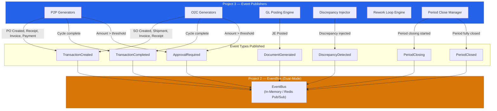
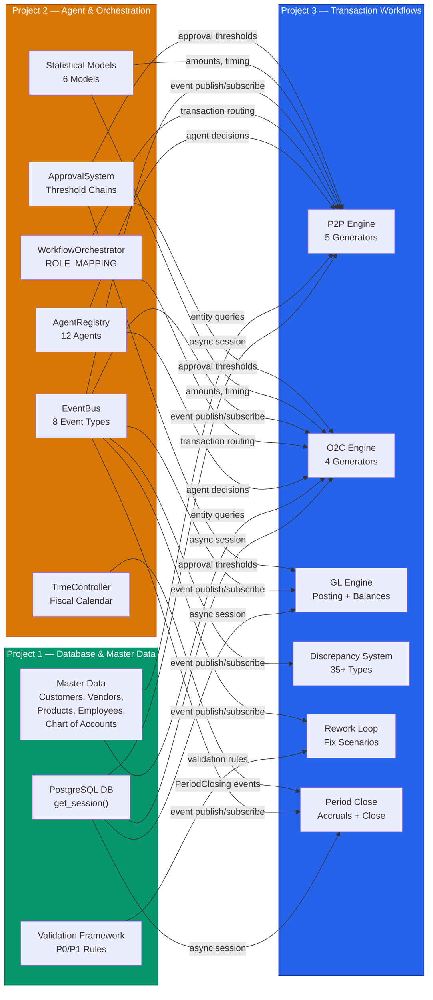

# Technical Specification

# 0. Agent Action Plan

## 0.1 Intent Clarification

### 0.1.1 Core Feature Objective

Based on the prompt, the Blitzy platform understands that the new feature requirement is to **build a complete end-to-end transaction generation system for the Synthetic ERP Data Generation Platform (Project 3: Transaction Workflows & Discrepancies)**. This system builds upon the existing Project 2 Agent & Orchestration Engine codebase and introduces six major functional domains:

- **Procure-to-Pay (P2P) Transaction Engine** — A five-class pipeline generating complete P2P cycles: Purchase Order → Goods Receipt → Vendor Invoice (with three-way matching) → Vendor Payment, producing all artifacts and General Ledger postings at each step
- **Order-to-Cash (O2C) Transaction Engine** — A four-class pipeline generating complete O2C cycles: Sales Order → Shipment → Customer Invoice → Customer Payment, with credit checks, payment allocation (FIFO), and GL postings
- **General Ledger Integration** — A posting engine that writes balanced journal entries (DR = CR within $0.01) for every transaction, maintains real-time account balances, supports accrual generation (GRNI, shipped-not-invoiced), and enforces continuous trial balance validation
- **Discrepancy Injection System** — A configurable injector implementing 35+ discrepancy types (15 P2P, 10 O2C, 5 GL, 5 Control) with ground truth label generation, parameter-bounded injection, and Easy (70%) / Medium (30%) difficulty distribution
- **Intelligent Rework Loop** — An autonomous error correction system that classifies validation failures, selects fix scenarios from a catalog, applies corrections (max 3 attempts per transaction), and escalates unresolvable errors for human review
- **Period Close Processing** — A period-end manager generating accruals, deferrals, depreciation entries, recurring journal entries, account reconciliations, and trial balance validation before closing fiscal periods

The system must satisfy **24 measurable success criteria** spanning four domains: Transaction Generation Performance (6 criteria), Discrepancy Injection (5 criteria), Financial Integrity (6 criteria), and Workflow Integrity (7 criteria).

**Implicit requirements detected:**

- Project 3 must consume Project 1's database session management (`from synthetic_erp.db.session import get_session`) and master data (customers, vendors, products, employees, Chart of Accounts) — this implies the Project 1 database layer and SQLAlchemy models are available as a dependency
- Project 3 must consume Project 2's agent framework (`app/agents/`), workflow orchestrator (`app/orchestration/`), event bus (`app/events/`), statistical models (`app/statistical/`), and time controller — all via constructor injection
- The `REQUIRED_ARTIFACTS` mapping in `app/orchestration/transaction_orchestrator.py` (lines 134–154) already defines artifact schemas for all 8 transaction types, which Project 3's generators must produce
- The `ROLE_MAPPING` in `app/orchestration/workflow_orchestrator.py` already maps all 8 transaction types to eligible agent roles, which Project 3's generators must respect
- The `EventType` enum in `app/events/event_types.py` already includes `DiscrepancyDetected` and `PeriodClosing`/`PeriodClosed` events that Project 3 must publish
- The approval system in `config/workflows/approval_thresholds.yaml` defines PO ($5K/$25K/$100K) and vendor invoice ($10K/$50K/$100K) thresholds that P2P generators must enforce
- The 12 specialized agents in `app/agents/specialized/` (AP Clerk, AP Manager, AR Clerk, AR Manager, Purchasing Agent, Purchasing Manager, Warehouse Clerk, Warehouse Manager, Accountant, Senior Accountant, Controller, CFO) will serve as decision-makers within the transaction workflows

### 0.1.2 Special Instructions and Constraints

**Critical directives captured from the user's specification:**

- **Python 3.11.7 REQUIRED**: Standardizing on Python 3.11 for specific `Decimal` rounding behavior and `typing.Self` support; `decimal.getcontext().prec = 28` and `rounding = ROUND_HALF_UP` must be configured globally
- **Database Session Pattern**: MUST use Project 1's session management — `from synthetic_erp.db.session import get_session` with `async with get_session() as session:` for all database operations
- **DB Transaction Rollback**: If ANY step in a multi-step posting fails, FULLY ROLLBACK the transaction — atomicity is non-negotiable
- **Overpayment Handling**: If Payment > Invoice, create Unapplied Cash record — do NOT allow negative invoice balances
- **Concurrent Access**: Use `SELECT FOR UPDATE` when reading balances to prevent race conditions
- **Payment Allocation**: FIFO (Oldest Invoice First) — not configurable
- **Variance Calculation**: Line-Item Level (calculated per line, then summed)
- **Accrual Method**: Straight-Line Daily (Total / Days in Period)
- **No Hard Difficulty Discrepancies**: MVP focuses on Easy/Medium only; hard difficulty distribution is 0.00
- **No External Workflow Engines**: Use in-memory code only — no Airflow, Prefect, or similar
- **Single Company Focus**: No intercompany, consolidation, or multi-currency for MVP
- **Structured JSON Logging**: ALL transaction operations MUST log in JSON format with the specified schema (timestamp, service_name, component, level, message, trace_id, simulation_id, etc.)
- **Circuit Breaker Configuration**: GL posting (10 failures → open, 60s recovery), discrepancy injection (20 failures → open, 30s recovery), rework loop (50 failures → open, 120s recovery)

**Architectural requirements:**

- Follow Project 2's constructor injection pattern (ADR-003) — all subsystems receive dependencies through constructors
- Use Pydantic V2 `BaseModel` for all data contracts at subsystem boundaries
- Publish events via the existing `EventBus` (ADR-001) for cross-subsystem coordination
- Use `structlog` for all logging (JSON to stdout only, no file handlers)
- Use `tenacity` for retry patterns with configurable exponential backoff
- Use seeded `random` (Python stdlib) generators for deterministic reproducibility

**User Example — Exception Hierarchy:**
```python
class TransactionError(Exception):
    """Base exception for all transaction errors."""
class BalanceError(TransactionError):
    """GL entry doesn't balance."""
```

**User Example — Retry Policy Table:**

| Operation | Retry Attempts | Backoff Strategy | Timeout | Fallback |
|-----------|---------------|-----------------|---------|----------|
| P2P cycle generation | 2 | Linear (1s, 2s) | 60s | Skip transaction |
| O2C cycle generation | 2 | Linear (1s, 2s) | 60s | Skip transaction |
| GL posting | 3 | Exponential (1s, 2s, 4s) | 30s | Rollback transaction |
| Three-way matching | 2 | Linear (500ms, 1s) | 10s | Mark as exception |
| Discrepancy injection | 1 | None | 5s | Skip discrepancy |
| Rework loop fix | 3 | Linear (1s, 2s, 3s) | 30s | Escalate to admin |
| Period close | 1 | None | 300s | Halt, require manual intervention |
| Balance update | 2 | Linear (500ms, 1s) | 10s | Rollback transaction |

### 0.1.3 Technical Interpretation

These feature requirements translate to the following technical implementation strategy:

- To **implement the P2P Transaction Engine**, we will create five new generator classes under `app/transactions/p2p/` (`PurchaseOrderGenerator`, `GoodsReceiptGenerator`, `VendorInvoiceProcessor`, `ThreeWayMatcher`, `VendorPaymentGenerator`) that extend a shared `TransactionGenerator` abstract base class in `app/transactions/base_generator.py`, consuming Project 2's `AgentRegistry`, `WorkflowOrchestrator`, `EventBus`, and statistical models via constructor injection, and writing transaction data through Project 1's `get_session()` async context manager

- To **implement the O2C Transaction Engine**, we will create four new generator classes under `app/transactions/o2c/` (`SalesOrderGenerator`, `ShipmentGenerator`, `CustomerInvoiceGenerator`, `CustomerPaymentProcessor`) following the same base class pattern, with credit check integration and FIFO payment allocation logic

- To **implement the GL Integration**, we will create four new classes under `app/transactions/gl/` (`GLPostingEngine`, `AccountBalanceManager`, `AccrualGenerator`, `PeriodCloseManager`) that enforce balanced journal entries (DR = CR within $0.01), maintain real-time account balances with `SELECT FOR UPDATE` locking, and support period-end accrual generation

- To **implement the Discrepancy Injection System**, we will create a `DiscrepancyInjector` and `GroundTruthGenerator` in `app/discrepancies/`, along with 35+ individual discrepancy type implementations organized under `app/discrepancies/p2p/` (15 types) and `app/discrepancies/o2c/` (10 types), with a central `DiscrepancyCatalog` mapping type codes to implementation classes and parameter bounds

- To **implement the Intelligent Rework Loop**, we will create four new classes under `app/rework/` (`ReworkLoopEngine`, `FailureClassifier`, `FixScenarioCatalog`, `FixScenarioExecutor`) that classify validation failures as planned-discrepancy vs. unplanned-error, select fix scenarios sorted by success rate, apply fixes with re-validation, and escalate after 3 failed attempts

- To **implement Period Close Processing**, we will extend the GL integration module with `PeriodCloseManager` and `AccrualGenerator` classes that subscribe to `PeriodClosing` events from Project 2's `TimeController`, generate GRNI accruals, shipped-not-invoiced accruals, and reversing entries, then validate trial balance before marking the period as CLOSED

- To **integrate with existing Project 2 infrastructure**, we will extend the existing `REQUIRED_ARTIFACTS` mapping, publish events through the `EventBus`, consume approval thresholds from `config/workflows/approval_thresholds.yaml`, and route transactions through the `WorkflowOrchestrator` to specialized agents for decision-making

## 0.2 Repository Scope Discovery

### 0.2.1 Comprehensive File Analysis

The following analysis catalogs every existing repository file and folder that must be evaluated, modified, or directly consumed by Project 3's transaction workflow and discrepancy injection system.

**Existing Modules to Modify or Extend:**

| File Path | Current Purpose | Required Modification |
|-----------|----------------|----------------------|
| `app/orchestration/transaction_orchestrator.py` | Tracks 8 transaction types with `REQUIRED_ARTIFACTS` mapping (lines 134–154) | Extend `REQUIRED_ARTIFACTS` to include P3-specific artifacts (e.g., `three_way_match_result`, `ground_truth`, `discrepancy_record`, `accrual_entry`, `period_close_summary`); may need additional artifact types per transaction |
| `app/orchestration/workflow_orchestrator.py` | Routes transactions to agents via `ROLE_MAPPING` (8 types → eligible roles) | Verify coverage for all P3 transaction types; potentially extend routing logic for rework loop re-submission and period close workflows |
| `app/orchestration/approval_system.py` | Enforces PO ($5K/$25K/$100K), vendor invoice ($10K/$50K/$100K), journal entry ($50K) approval thresholds | Consume as-is for P2P and GL approval chains; no modification needed unless new approval types are required |
| `app/orchestration/time_controller.py` | Advances simulation day-by-day; emits `PeriodClosing`/`PeriodClosed` events | Subscribe to `PeriodClosing` events to trigger period close processing; consume fiscal period state for posting validation |
| `app/orchestration/fiscal_calendar.py` | Manages fiscal periods (OPEN → CLOSING → CLOSED) | Consume for period boundary validation; no modification needed |
| `app/orchestration/business_calendar.py` | US Federal holidays, working hours (08:00–17:00) | Consume for date calculations; no modification needed |
| `app/events/event_types.py` | Defines 8 canonical event types including `DiscrepancyDetected`, `PeriodClosing`, `PeriodClosed` | Consume existing event types for publishing; potentially add new event types for GL posting, rework loop events |
| `app/events/event_bus.py` | Dual-mode EventBus (in-memory / Redis Pub/Sub) | Consume via constructor injection for publishing transaction, discrepancy, GL, and rework events |
| `app/events/event_store.py` | Redis JSONB event persistence (7-day TTL) | Consume for event persistence; no modification needed |
| `app/agents/agent_registry.py` | 50-agent cap, role-based lookup, lifecycle management | Consume for agent assignment during transaction processing |
| `app/agents/base_agent.py` | Abstract base agent with 5-state lifecycle | Consume agent decision framework; P3 generators use agents for decisions |
| `app/agents/decision_engine.py` | 4-layer pipeline (Statistical → LLM → Validation → Deterministic) | Consume for qualitative decisions within transaction workflows |
| `app/agents/action_registry.py` | 14 registered ERP actions (P2P, O2C, Financial) | Consume existing actions; may register additional P3-specific actions |
| `app/agents/specialized/*.py` | 12 specialized agent implementations | Consume as-is; agents make decisions within P3 workflows |
| `app/simulation/simulation_engine.py` | Composition root; 5-step daily pipeline | Extend to integrate P3 transaction generators into Step 2 (Generate Interactions) and Step 3 (Route Transactions); inject P3 subsystems |
| `app/simulation/simulation_metrics.py` | `DailyMetricsSnapshot` and `MonthlyMetricsAggregate` | Extend to track P3-specific metrics (P2P/O2C rates, GL posting counts, discrepancy injection rates, rework success rates) |
| `app/simulation/day_context.py` | Per-day validated state container | May extend to carry P3-specific daily context (open POs, pending invoices, etc.) |
| `app/statistical/amount_distributions.py` | Log-normal amount distributions | Consume for generating realistic transaction amounts |
| `app/statistical/payment_timing_model.py` | 5-segment mixture model for payment timing | Consume for determining payment dates in P2P and O2C flows |
| `app/statistical/order_frequency_model.py` | Poisson order frequency with day-of-week multipliers | Consume for generating order volumes per day |
| `app/statistical/selection_models.py` | Pareto (80/20) entity selection | Consume for vendor/customer/product selection |
| `app/external_world/*.py` | Customer, Vendor, Bank simulators with tiered entity pools | Consume for master data access; P3 generators query entity pools |
| `app/errors/error_handlers.py` | LLM, Agent, Workflow error handlers with credential scrubbing | Extend with P3-specific error handlers (transaction, GL, discrepancy, rework) |

**Configuration Files:**

| File Path | Current Contents | Required Action |
|-----------|-----------------|-----------------|
| `config/workflows/approval_thresholds.yaml` | PO, vendor invoice, journal entry thresholds | Consume as-is; add transaction-specific approval rules if needed |
| `config/agents/agent_roles.yaml` | 12 agent role templates with personality traits | Consume as-is; agents serve as decision-makers in P3 workflows |
| `config/llm/llm_config.yaml` | LLM provider, model, resilience configuration | Consume as-is for LLM-powered agent decisions |
| `config/statistical/amount_distributions.yaml` | Log-normal distribution parameters | Consume as-is for amount generation |
| `config/statistical/payment_timing.yaml` | 5-segment mixture model parameters | Consume as-is for payment timing |
| `prompts/*.yaml` | 6 prompt templates (approve_transaction, process_vendor_invoice, match_documents, reconcile_account, etc.) | Consume existing templates; may add new templates for P3-specific agent decisions |
| `.env.example` | LLM, Redis environment variables | Extend with P3 environment variables (TRANSACTION_BATCH_SIZE, GL_POSTING_BATCH_SIZE, DISCREPANCY_* variables, REWORK_LOOP_* variables, CONCURRENT_TRANSACTION_LIMIT, ENABLE_TRANSACTION_CACHING) |
| `pyproject.toml` | Package metadata, dev dependencies, pytest config | Extend with P3-specific dependencies (psycopg2-binary, sqlalchemy, aiofiles, pydantic-settings, hypothesis) |
| `requirements.txt` | 13 production dependencies | Extend with P3-specific production dependencies |
| `requirements-dev.txt` | Test dependencies (pytest, fakeredis, aioresponses) | Extend with P3 test dependencies (pytest-mock, hypothesis) |
| `pytest.ini` | Test configuration with markers | Add P3-specific test markers (e.g., `financial`, `discrepancy`, `rework`) |

**Test Files to Update:**

| File Path | Required Update |
|-----------|----------------|
| `tests/conftest.py` | Add P3-specific fixtures (mock database sessions, mock GL engine, discrepancy config fixtures, rework loop fixtures) |
| `tests/test_orchestration/test_transaction_orchestrator.py` | Add tests for extended `REQUIRED_ARTIFACTS` mapping |
| `tests/test_orchestration/test_workflow_orchestrator.py` | Add tests for P3 transaction routing patterns |
| `tests/test_simulation/test_simulation_engine.py` | Add tests for P3 integration into daily pipeline |

**Integration Point Discovery:**

- **Database Models/Migrations**: Project 3 writes to transaction tables owned by Project 1; all database access via `get_session()` from `synthetic_erp.db.session`
- **API Endpoints**: No new API endpoints (Project 3 is a library, not a web service); consumes Project 1 REST API via `aiohttp` for master data queries
- **Service Classes**: All P3 generators receive `AgentRegistry`, `WorkflowOrchestrator`, `EventBus`, and `GLPostingEngine` via constructor injection
- **Controllers/Handlers**: The `SimulationEngine` serves as the composition root; P3 generators are injected alongside existing P2 subsystems
- **Middleware/Interceptors**: No middleware; circuit breaker pattern implemented within each P3 service class

### 0.2.2 New File Requirements

**New Source Files to Create:**

| File Path | Purpose |
|-----------|---------|
| `app/transactions/__init__.py` | Package init; exports base classes and generator registry |
| `app/transactions/base_generator.py` | Abstract `TransactionGenerator` base class with shared logic: discrepancy trigger checking, GL posting delegation, event publishing, retry/timeout policies |
| `app/transactions/p2p/__init__.py` | P2P package init; exports all 5 P2P generator classes |
| `app/transactions/p2p/purchase_order_generator.py` | `PurchaseOrderGenerator` — vendor selection, product selection (EOQ), pricing, approval routing, PO header/lines creation |
| `app/transactions/p2p/goods_receipt_generator.py` | `GoodsReceiptGenerator` — receipt against open POs, quantity variance handling, inventory balance updates, GL posting (DR Inventory, CR AP Accrual) |
| `app/transactions/p2p/vendor_invoice_processor.py` | `VendorInvoiceProcessor` — invoice creation, PO linkage, three-way matching, AP clerk routing, GL posting (DR Expense/Asset, CR AP) |
| `app/transactions/p2p/three_way_matcher.py` | `ThreeWayMatcher` — PO/Receipt/Invoice matching with ±5% price and ±2% quantity tolerances, match status determination |
| `app/transactions/p2p/vendor_payment_generator.py` | `VendorPaymentGenerator` — payment grouping by vendor/terms, discount calculation, check/ACH/wire selection, GL posting (DR AP, CR Cash) |
| `app/transactions/o2c/__init__.py` | O2C package init; exports all 4 O2C generator classes |
| `app/transactions/o2c/sales_order_generator.py` | `SalesOrderGenerator` — customer selection, credit check, product selection, pricing with discounts, SO header/lines creation |
| `app/transactions/o2c/shipment_generator.py` | `ShipmentGenerator` — shipment against open SOs, carrier selection, tracking number generation, inventory reduction, GL posting (DR COGS, CR Inventory) |
| `app/transactions/o2c/customer_invoice_generator.py` | `CustomerInvoiceGenerator` — invoice from shipped order, payment terms, due date calculation, GL posting (DR AR, CR Revenue) |
| `app/transactions/o2c/customer_payment_processor.py` | `CustomerPaymentProcessor` — FIFO payment allocation, short pay handling, overpay → unapplied cash, GL posting (DR Cash, CR AR) |
| `app/transactions/gl/__init__.py` | GL package init; exports GL engine and balance manager |
| `app/transactions/gl/gl_posting_engine.py` | `GLPostingEngine` — journal entry creation, balance validation (DR = CR), account validation against COA, period validation, trial balance check |
| `app/transactions/gl/account_balance_manager.py` | `AccountBalanceManager` — real-time balance maintenance with `SELECT FOR UPDATE`, normal balance direction enforcement, period-based tracking |
| `app/transactions/gl/accrual_generator.py` | `AccrualGenerator` — AP accruals (GRNI), AR accruals (shipped not invoiced), straight-line daily method, reversing entries |
| `app/transactions/gl/period_close_manager.py` | `PeriodCloseManager` — period close orchestration: validate all posted, generate accruals/deferrals, depreciation, recurring JEs, reconciliations, trial balance, close period |
| `app/discrepancies/__init__.py` | Discrepancy package init; exports injector, ground truth generator, catalog |
| `app/discrepancies/discrepancy_injector.py` | `DiscrepancyInjector` — rate-based injection trigger, type selection (weighted), parameter validation, ground truth linkage |
| `app/discrepancies/ground_truth_generator.py` | `GroundTruthGenerator` — ground truth record creation with full schema (discrepancy_id, transaction_ids, detection_method, financial_impact, etc.) |
| `app/discrepancies/discrepancy_catalog.py` | `DiscrepancyCatalog` — registry mapping 35+ type codes (P2P-001 through CTL-005) to implementation classes and parameter bounds |
| `app/discrepancies/p2p/__init__.py` | P2P discrepancy package init |
| `app/discrepancies/p2p/duplicate_invoice.py` | P2P-001: Duplicate Invoice (exact/near-duplicate) |
| `app/discrepancies/p2p/price_mismatch.py` | P2P-002: Invoice/PO Price Mismatch |
| `app/discrepancies/p2p/quantity_variance.py` | P2P-003: Invoice/Receipt Quantity Variance |
| `app/discrepancies/p2p/missing_po.py` | P2P-004: Missing Purchase Order |
| `app/discrepancies/p2p/po_not_approved.py` | P2P-005: PO Not Approved |
| `app/discrepancies/p2p/invoice_before_receipt.py` | P2P-006: Invoice Before Receipt |
| `app/discrepancies/p2p/round_dollar_invoice.py` | P2P-007: Round-Dollar Invoice (fraud indicator) |
| `app/discrepancies/p2p/weekend_processing.py` | P2P-008: Weekend Processing |
| `app/discrepancies/p2p/duplicate_payment.py` | P2P-009: Duplicate Payment |
| `app/discrepancies/p2p/payment_before_invoice.py` | P2P-010: Payment Before Invoice Date |
| `app/discrepancies/p2p/unapproved_vendor.py` | P2P-011: Vendor Not in Approved List |
| `app/discrepancies/p2p/split_po.py` | P2P-012: Split PO to Avoid Approval |
| `app/discrepancies/p2p/fictitious_vendor.py` | P2P-013: Fictitious Vendor (address matches employee) |
| `app/discrepancies/p2p/vendor_concentration.py` | P2P-014: Unusual Vendor Concentration |
| `app/discrepancies/p2p/ghost_expense.py` | P2P-015: Ghost Expense (no supporting documentation) |
| `app/discrepancies/o2c/__init__.py` | O2C discrepancy package init |
| `app/discrepancies/o2c/duplicate_customer_invoice.py` | O2C-001: Duplicate Customer Invoice |
| `app/discrepancies/o2c/invoice_without_shipment.py` | O2C-002: Invoice Without Shipment |
| `app/discrepancies/o2c/credit_limit_exceeded.py` | O2C-003: Credit Limit Exceeded |
| `app/discrepancies/o2c/short_payment.py` | O2C-004: Short Payment |
| `app/discrepancies/o2c/overpayment_not_returned.py` | O2C-005: Overpayment Not Returned |
| `app/discrepancies/o2c/revenue_recognition_timing.py` | O2C-006: Revenue Recognition Timing Error |
| `app/discrepancies/o2c/fictitious_customer.py` | O2C-007: Fictitious Customer |
| `app/discrepancies/o2c/round_tripping.py` | O2C-008: Round-Tripping (circular transactions) |
| `app/discrepancies/o2c/channel_stuffing.py` | O2C-009: Channel Stuffing (premature shipments) |
| `app/discrepancies/o2c/side_agreements.py` | O2C-010: Side Agreements Not Disclosed |
| `app/discrepancies/gl/__init__.py` | GL discrepancy package init |
| `app/discrepancies/gl/unbalanced_journal.py` | GL-001: Unbalanced Journal Entry |
| `app/discrepancies/gl/journal_no_approval.py` | GL-002: Journal Entry Without Approval |
| `app/discrepancies/gl/suspicious_adjusting.py` | GL-003: Period-End Adjusting Entry (suspicious) |
| `app/discrepancies/gl/unusual_account_combo.py` | GL-004: Unusual Account Combination |
| `app/discrepancies/gl/manual_override.py` | GL-005: Manual Entry Overriding System Entry |
| `app/discrepancies/control/__init__.py` | Control discrepancy package init |
| `app/discrepancies/control/sod_violation.py` | CTL-001: Segregation of Duties Violation |
| `app/discrepancies/control/self_approval.py` | CTL-002: Same User Created and Approved |
| `app/discrepancies/control/approval_limit_exceeded.py` | CTL-003: Approval Limit Exceeded |
| `app/discrepancies/control/backdated_transaction.py` | CTL-004: Backdated Transaction |
| `app/discrepancies/control/holiday_transaction.py` | CTL-005: Transaction on Holiday/Weekend |
| `app/rework/__init__.py` | Rework package init |
| `app/rework/rework_loop_engine.py` | `ReworkLoopEngine` — orchestrates the rework loop: classify → select fix → apply → re-validate → escalate |
| `app/rework/failure_classifier.py` | `FailureClassifier` — classifies validation failures as planned discrepancy (within/outside parameters) or unplanned error |
| `app/rework/fix_scenario_catalog.py` | `FixScenarioCatalog` — 20+ fix scenarios with names, steps, and success rates (e.g., ADJUST_AMOUNT_TO_RANGE, FIX_DATE_SEQUENCE) |
| `app/rework/fix_scenario_executor.py` | `FixScenarioExecutor` — executes fix scenarios against transactions; handles timeout and failure |

**New Configuration Files:**

| File Path | Purpose |
|-----------|---------|
| `config/discrepancies/p2p_discrepancies.yaml` | P2P discrepancy type definitions, base rates, parameter bounds |
| `config/discrepancies/o2c_discrepancies.yaml` | O2C discrepancy type definitions, base rates, parameter bounds |
| `config/discrepancies/gl_discrepancies.yaml` | GL and Control discrepancy type definitions |
| `config/discrepancies/discrepancy_rates.yaml` | Global discrepancy injection rates, difficulty distribution, auto-adjust settings |
| `config/transactions/approval_thresholds.yaml` | Transaction-specific approval thresholds (extending existing config) |
| `config/transactions/posting_rules.yaml` | GL posting rules per transaction type (debit/credit account mappings) |
| `config/transactions/period_close.yaml` | Period close configuration (accrual rules, reconciliation settings) |

**New Test Files:**

| File Path | Purpose |
|-----------|---------|
| `tests/test_transactions/__init__.py` | Transaction tests package init |
| `tests/test_transactions/test_p2p_cycle.py` | Full P2P cycle tests (PO → Receipt → Invoice → Payment), artifact completeness, GL balance verification |
| `tests/test_transactions/test_o2c_cycle.py` | Full O2C cycle tests (Order → Ship → Invoice → Receipt), credit check, FIFO allocation |
| `tests/test_transactions/test_gl_posting.py` | GL posting engine tests: balance validation, trial balance, account validation, period validation, concurrent posting |
| `tests/test_transactions/test_three_way_matching.py` | Three-way matching tests: tolerance checks, match statuses, variance calculations |
| `tests/test_transactions/test_period_close.py` | Period close tests: accrual generation, trial balance, period state transitions |
| `tests/test_transactions/test_base_generator.py` | Base generator abstract class tests |
| `tests/test_discrepancies/__init__.py` | Discrepancy tests package init |
| `tests/test_discrepancies/test_discrepancy_injection.py` | Injection rate control, type distribution, parameter bounds validation |
| `tests/test_discrepancies/test_ground_truth.py` | Ground truth completeness, schema validation, transaction linkage |
| `tests/test_discrepancies/test_individual_discrepancies.py` | Per-type discrepancy tests (P2P-001 through CTL-005), parameterized across all 35+ types |
| `tests/test_discrepancies/test_discrepancy_catalog.py` | Catalog completeness, type registration, parameter bounds |
| `tests/test_rework/__init__.py` | Rework tests package init |
| `tests/test_rework/test_rework_loop.py` | End-to-end rework loop tests: classify → fix → re-validate → escalate, max 3 attempts, escalation threshold |
| `tests/test_rework/test_failure_classifier.py` | Failure classification tests: planned vs. unplanned, parameter bounds checking |
| `tests/test_rework/test_fix_scenarios.py` | Fix scenario catalog tests: scenario selection, exclusion of failed scenarios, success rate sorting |

### 0.2.3 Web Search Research Conducted

The following research areas were identified from the user's specification to inform implementation decisions:

- **Three-Way Matching Best Practices**: Industry-standard tolerance thresholds for PO/Receipt/Invoice matching (±5% price, ±2% quantity as specified)
- **Discrepancy Injection Patterns**: Approaches for realistic financial fraud simulation, including duplicate invoice detection heuristics and fictitious vendor indicators
- **Period Close Accounting**: GRNI (Goods Received Not Invoiced) accrual calculation methods, straight-line daily accrual computation
- **FIFO Payment Allocation**: Implementation patterns for oldest-invoice-first payment application with short pay and overpay handling
- **Circuit Breaker Pattern**: Python implementation using `tenacity` or custom state machines for the three configured circuit breakers (GL posting, discrepancy injection, rework loop)
- **SELECT FOR UPDATE Patterns**: SQLAlchemy async implementation for pessimistic locking during concurrent balance updates

## 0.3 Dependency Inventory

### 0.3.1 Private and Public Packages

The following table lists all key packages relevant to the Project 3 feature addition. Packages are divided into those already present in the Project 2 codebase (to be consumed) and those that must be added for Project 3's specific requirements.

**Existing Packages (from Project 2 `requirements.txt`):**

| Registry | Package Name | Version | Purpose in Project 3 |
|----------|-------------|---------|---------------------|
| PyPI | `structlog` | ≥24.1.0 | Structured JSON logging for all transaction, GL, discrepancy, and rework operations |
| PyPI | `pydantic` | ≥2.5.0 | Pydantic V2 data contracts for all transaction models, GL entries, discrepancy records, ground truth schemas |
| PyPI | `numpy` | ≥1.26.0 | Array operations and seeded `RandomState` for deterministic transaction amount generation |
| PyPI | `scipy` | ≥1.12.0 | Statistical distributions for amount (log-normal), timing (mixture), and frequency (Poisson) models |
| PyPI | `tenacity` | ≥8.2.0 | Retry with exponential/linear backoff for all P3 operation retry policies (8 operations) |
| PyPI | `redis` | ≥7.0.0 | Event persistence via EventBus/EventStore; agent state caching |
| PyPI | `python-dateutil` | ≥2.8.0 | Date arithmetic for payment due dates, lead times, fiscal period calculations |
| PyPI | `holidays` | ≥0.40 | US Federal holiday detection for business day validation |
| PyPI | `faker` | ≥22.0.0 | Synthetic data generation for vendor names, addresses, invoice numbers |
| PyPI | `anthropic` | ≥0.79.0 | LLM provider for agent decision-making (process_vendor_invoice, approve_transaction) |
| PyPI | `openai` | ≥2.20.0 | Fallback LLM provider for agent decisions |
| PyPI | `aiohttp` | ≥3.9.0 | Async HTTP client for Project 1 REST API master data queries |
| PyPI | `sentence-transformers` | ≥2.3.0 | Agent memory semantic search (consumed indirectly via agents) |

**New Packages Required for Project 3 (from user specification):**

| Registry | Package Name | Version | Purpose in Project 3 |
|----------|-------------|---------|---------------------|
| PyPI | `sqlalchemy` | ==2.0.25 | ORM and async database access for transaction persistence; used with `get_session()` from Project 1 |
| PyPI | `psycopg2-binary` | ==2.9.9 | PostgreSQL adapter for SQLAlchemy async sessions (Project 1 database) |
| PyPI | `aiofiles` | ==23.2.1 | Async file I/O for ground truth JSON/CSV output files |
| PyPI | `pydantic-settings` | ==2.2.0 | Environment variable loading for P3 configuration (TRANSACTION_BATCH_SIZE, DISCREPANCY_* vars) |
| PyPI | `pandas` | ==2.2.0 | DataFrame operations for ground truth summary CSV generation and batch analytics |

**New Test/Dev Packages Required:**

| Registry | Package Name | Version | Purpose |
|----------|-------------|---------|---------|
| PyPI | `pytest-mock` | ≥3.12.0 | Advanced mocking for transaction generator tests and GL posting stubs |
| PyPI | `hypothesis` | ≥6.92.0 | Property-based testing for transaction generation validation (amounts, balances, sequences) |

### 0.3.2 Dependency Updates

**Import Updates:**

Files requiring new imports to integrate P3 modules:

- `app/simulation/simulation_engine.py` — Add imports for P3 transaction generators, discrepancy injector, rework loop engine, and period close manager; extend constructor to accept P3 subsystems
- `app/simulation/simulation_metrics.py` — Add metric counters for P3 domains (P2P rate, O2C rate, GL posting rate, discrepancy count, rework success rate)
- `app/errors/error_handlers.py` — Add imports for P3-specific exception types (`TransactionError`, `BalanceError`, `ThreeWayMatchError`, etc.)
- `app/orchestration/transaction_orchestrator.py` — Extend `REQUIRED_ARTIFACTS` with additional P3 artifact types if needed
- `tests/conftest.py` — Add P3-specific fixtures and mock factories

**Import Transformation Rules:**

- All P3 internal imports use the new package paths:
  ```python
  from app.transactions.p2p.purchase_order_generator import PurchaseOrderGenerator
  ```
- Project 1 database imports follow the specified pattern:
  ```python
  from synthetic_erp.db.session import get_session
  ```
- All P3 modules use relative imports within their own package and absolute imports for cross-package references

**External Reference Updates:**

| File | Update Required |
|------|----------------|
| `requirements.txt` | Add `sqlalchemy==2.0.25`, `psycopg2-binary==2.9.9`, `aiofiles==23.2.1`, `pydantic-settings==2.2.0`, `pandas==2.2.0` |
| `requirements-dev.txt` | Add `pytest-mock>=3.12.0`, `hypothesis>=6.92.0` |
| `pyproject.toml` | Update `[project.dependencies]` and `[project.optional-dependencies.dev]` to include P3 packages; update coverage configuration to include `app/transactions/`, `app/discrepancies/`, `app/rework/` |
| `.env.example` | Add all P3 environment variables: `TRANSACTION_BATCH_SIZE`, `GL_POSTING_BATCH_SIZE`, `DISCREPANCY_INJECTION_ENABLED`, `DISCREPANCY_DEFAULT_RATE`, `DISCREPANCY_DIFFICULTY_DISTRIBUTION`, `REWORK_LOOP_ENABLED`, `REWORK_LOOP_MAX_ATTEMPTS`, `REWORK_LOOP_TIMEOUT_SECONDS`, `REWORK_ESCALATION_THRESHOLD`, `CONCURRENT_TRANSACTION_LIMIT`, `ENABLE_TRANSACTION_CACHING` |
| `pytest.ini` | Add markers: `financial` (tests involving GL balance assertions), `discrepancy` (discrepancy injection tests), `rework` (rework loop tests), `p2p` (P2P cycle tests), `o2c` (O2C cycle tests) |

## 0.4 Integration Analysis

### 0.4.1 Existing Code Touchpoints

**Direct Modifications Required:**

- **`app/simulation/simulation_engine.py`** (Composition Root): Extend the constructor to accept P3 subsystems via constructor injection — `TransactionGeneratorRegistry` (or individual P2P/O2C generators), `DiscrepancyInjector`, `GLPostingEngine`, `ReworkLoopEngine`, and `PeriodCloseManager`. Modify Step 2 (`_generate_interactions()`) to invoke P3 transaction generators after P2's `ExternalWorldManager` produces interaction items. Modify Step 3 (`_route_transactions()`) to pass generated transactions through the discrepancy injection pipeline before routing to agents. Add a new Step 4.5 or extend Step 5 to execute rework loop validation on completed transactions before finalization.

- **`app/simulation/simulation_metrics.py`** (Metrics Tracking): Add new metric counters and aggregation fields for P3 operations — `p2p_cycles_completed`, `o2c_cycles_completed`, `gl_entries_posted`, `discrepancies_injected`, `ground_truths_created`, `rework_attempts`, `rework_successes`, `rework_escalations`, `period_closes_completed`, `trial_balance_checks_passed`. Extend `DailyMetricsSnapshot` and `MonthlyMetricsAggregate` Pydantic models to carry these fields.

- **`app/simulation/day_context.py`** (Daily State): Extend `DayContext` to carry P3-specific daily context — open purchase orders awaiting receipt, pending vendor invoices awaiting match, unposted GL entries, active rework items. This enables P3 generators to query the day's state for realistic transaction sequencing (e.g., cannot generate a goods receipt if no POs are open).

- **`app/errors/error_handlers.py`** (Error Infrastructure): Add a new `TransactionErrorHandler` class alongside the existing `LLMErrorHandler`, `AgentErrorHandler`, and `WorkflowErrorHandler`. This handler will implement the retry policies defined in the user specification (8 operations with specific retry counts, backoff strategies, timeouts, and fallbacks). It must integrate with the circuit breaker configuration for GL posting, discrepancy injection, and rework loop operations.

- **`.env.example`** (Environment Template): Append all 11 P3 environment variables with comments documenting their purpose, valid ranges, and defaults (TRANSACTION_BATCH_SIZE=100, GL_POSTING_BATCH_SIZE=500, DISCREPANCY_INJECTION_ENABLED=true, DISCREPANCY_DEFAULT_RATE=0.02, etc.).

- **`requirements.txt`** (Production Dependencies): Add 5 new production dependencies: `sqlalchemy==2.0.25`, `psycopg2-binary==2.9.9`, `aiofiles==23.2.1`, `pydantic-settings==2.2.0`, `pandas==2.2.0`.

- **`requirements-dev.txt`** (Dev Dependencies): Add 2 new test dependencies: `pytest-mock>=3.12.0`, `hypothesis>=6.92.0`.

- **`pyproject.toml`** (Package Configuration): Update `[project.dependencies]` to list P3 packages, extend `[tool.pytest.ini_options]` markers, and update `[tool.coverage.run]` source paths to include `app/transactions`, `app/discrepancies`, `app/rework`.

- **`pytest.ini`** (Test Configuration): Add custom markers `financial`, `discrepancy`, `rework`, `p2p`, `o2c` for selective test execution of P3 test suites.

- **`tests/conftest.py`** (Test Fixtures): Add P3-specific shared fixtures — mock database session factory, mock GL posting engine, mock discrepancy injector, mock rework loop, sample transaction data factories (PO, SO, invoice, receipt, shipment, payment, journal entry), and deterministic seeding helpers.

**Dependency Injections:**

- **`app/simulation/simulation_engine.py`** (Constructor): Register all P3 subsystems as optional constructor parameters — `gl_posting_engine: Optional[GLPostingEngine] = None`, `discrepancy_injector: Optional[DiscrepancyInjector] = None`, `rework_loop_engine: Optional[ReworkLoopEngine] = None`, `period_close_manager: Optional[PeriodCloseManager] = None`. Following Project 2's pattern (ADR-003), `None` values silently skip functionality, enabling incremental integration and test isolation.

- **P3 Generators Internal Wiring**: Each transaction generator receives its dependencies via constructor — `db` (AsyncSession from `get_session()`), `agent_registry` (from P2), `discrepancy_injector`, `gl_posting_engine`, `event_bus` (from P2). The `TransactionGenerator` base class defines the injection interface.

**Database/Schema Updates:**

- **Project 1 Database**: P3 writes to transaction-related tables that are defined and owned by Project 1's schema. No direct DDL (CREATE TABLE, ALTER TABLE) will be issued by P3 — all table definitions are assumed to exist in Project 1's migration history. P3 accesses these tables exclusively through SQLAlchemy ORM models and Project 1's `get_session()` context manager.

- **New Tables Written by P3** (defined by Project 1, written by P3): `purchase_orders`, `purchase_order_lines`, `goods_receipts`, `goods_receipt_lines`, `vendor_invoices`, `vendor_invoice_lines`, `vendor_payments`, `vendor_payment_allocations`, `sales_orders`, `sales_order_lines`, `shipments`, `shipment_lines`, `customer_invoices`, `customer_invoice_lines`, `customer_receipts`, `customer_receipt_allocations`, `journal_entries`, `journal_entry_lines`, `account_balances`, `discrepancies`, `ground_truths`, `rework_attempts`

**Event Integration:**



**Cross-Project Integration Map:**



## 0.5 Technical Implementation

### 0.5.1 File-by-File Execution Plan

**CRITICAL: Every file listed below MUST be created or modified.**

**Group 1 — Core Transaction Infrastructure:**

| Action | File Path | Description |
|--------|-----------|-------------|
| CREATE | `app/transactions/__init__.py` | Package init; exports `TransactionGenerator`, `GenerationContext`, `TransactionResult` |
| CREATE | `app/transactions/base_generator.py` | Abstract `TransactionGenerator` base class defining the generate/validate/post contract; shared discrepancy trigger check, GL posting delegation, event publishing, retry/timeout wrappers using `tenacity`; `GenerationContext` Pydantic model carrying simulation_id, current_date, fiscal_period, discrepancy_config, rng_seed |
| CREATE | `app/transactions/exceptions.py` | Custom exception hierarchy: `TransactionError` (base), `TransactionGenerationError`, `BalanceError`, `ThreeWayMatchError`, `DiscrepancyInjectionError`, `ReworkLoopError`, `PeriodClosedError`, `GLPostingError`, `PaymentAllocationError`, `ConcurrencyError` |
| CREATE | `app/transactions/constants.py` | Shared constants: `TRANSACTION_PROCESSING_LIMITS`, `PERFORMANCE_THRESHOLDS`, `MEMORY_LIMITS`, `FINANCIAL_TOLERANCES`, `BATCH_LIMITS`, `CIRCUIT_BREAKER_CONFIG`, timeout matrices |

**Group 2 — P2P Transaction Engine (5 generators):**

| Action | File Path | Description |
|--------|-----------|-------------|
| CREATE | `app/transactions/p2p/__init__.py` | Exports all P2P generators |
| CREATE | `app/transactions/p2p/purchase_order_generator.py` | `PurchaseOrderGenerator` — weighted vendor selection, EOQ-based quantity calculation, price list lookup, approval routing per thresholds, PO header/lines creation, sequential numbering (PO-YYYY-NNNN), event publishing |
| CREATE | `app/transactions/p2p/goods_receipt_generator.py` | `GoodsReceiptGenerator` — finds open POs, determines receipt date (PO date + lead time), quantity variance handling, receipt header/lines creation, inventory balance update, GL posting (DR Inventory, CR AP Accrual) |
| CREATE | `app/transactions/p2p/vendor_invoice_processor.py` | `VendorInvoiceProcessor` — invoice creation from vendor, PO linkage, three-way match invocation, AP clerk routing via WorkflowOrchestrator, GL account coding, approval chain, GL posting (DR Expense/Asset, CR AP) |
| CREATE | `app/transactions/p2p/three_way_matcher.py` | `ThreeWayMatcher` — quantity match (Receipt vs Invoice), price match (PO vs Invoice), extended amount validation, tolerance enforcement (price ±5%, quantity ±2%), returns `ThreeWayMatchResult` with match status, variances, and approval requirement flag |
| CREATE | `app/transactions/p2p/vendor_payment_generator.py` | `VendorPaymentGenerator` — selects approved unpaid invoices, groups by vendor/terms, calculates payment amount (invoice - prior payments - discounts), payment method selection (check/ACH/wire), payment allocations, GL posting (DR AP, CR Cash; DR Discount if applicable) |

**Group 3 — O2C Transaction Engine (4 generators):**

| Action | File Path | Description |
|--------|-----------|-------------|
| CREATE | `app/transactions/o2c/__init__.py` | Exports all O2C generators |
| CREATE | `app/transactions/o2c/sales_order_generator.py` | `SalesOrderGenerator` — revenue-weighted customer selection, credit limit check (credit_limit vs current_ar_balance), product selection from purchase history, pricing with discounts, SO header/lines, sequential numbering (SO-YYYY-NNNN) |
| CREATE | `app/transactions/o2c/shipment_generator.py` | `ShipmentGenerator` — finds open SOs ready to ship, determines ship date (order date + lead time), carrier selection, tracking number generation, shipment header/lines, inventory reduction, GL posting (DR COGS, CR Inventory) |
| CREATE | `app/transactions/o2c/customer_invoice_generator.py` | `CustomerInvoiceGenerator` — creates invoice from shipped order, links to SO and shipment, calculates amounts from shipment quantities, payment terms from customer master, GL posting (DR AR, CR Revenue), sequential numbering (INV-YYYY-NNNN) |
| CREATE | `app/transactions/o2c/customer_payment_processor.py` | `CustomerPaymentProcessor` — FIFO allocation (oldest invoice first), short pay handling (create write-off or leave open), overpay handling (create Unapplied Cash — no negative invoice balance), GL posting (DR Cash, CR AR; DR Discount, DR Bad Debt if applicable) |

**Group 4 — General Ledger Integration (4 classes):**

| Action | File Path | Description |
|--------|-----------|-------------|
| CREATE | `app/transactions/gl/__init__.py` | Exports GL engine, balance manager, accrual generator, period close manager |
| CREATE | `app/transactions/gl/gl_posting_engine.py` | `GLPostingEngine` — journal entry header creation, balance validation (SUM(debits) = SUM(credits) within $0.01), account validation against Chart of Accounts (is_posting=TRUE), period validation (is period OPEN), sequential JE numbering, entry lines creation, balance update delegation, trial balance continuous check |
| CREATE | `app/transactions/gl/account_balance_manager.py` | `AccountBalanceManager` — `SELECT FOR UPDATE` locking for concurrent access, normal balance direction enforcement (Asset/Expense: DR increases; Liability/Equity/Revenue: CR increases), running balance maintenance, period-based balance tracking |
| CREATE | `app/transactions/gl/accrual_generator.py` | `AccrualGenerator` — AP accruals for GRNI (DR Expense/Asset, CR AP Accrual), AR accruals for shipped-not-invoiced (DR AR, CR Revenue), straight-line daily method (Total / Days in Period), reversing entries for next period |
| CREATE | `app/transactions/gl/period_close_manager.py` | `PeriodCloseManager` — 10-step close process: validate all posted → generate accruals → generate deferrals → post depreciation → recurring JEs → account reconciliations → trial balance → validate financial statements → close period → open next period |

**Group 5 — Discrepancy Injection System (40+ components):**

| Action | File Path | Description |
|--------|-----------|-------------|
| CREATE | `app/discrepancies/__init__.py` | Exports injector, ground truth generator, catalog |
| CREATE | `app/discrepancies/discrepancy_injector.py` | `DiscrepancyInjector` — rate-based trigger check (random vs configured rate), type selection (weighted by category), parameter validation against bounds, auto-adjust to bounds if enabled, ground truth linkage |
| CREATE | `app/discrepancies/ground_truth_generator.py` | `GroundTruthGenerator` — creates ground truth records with full schema (16 fields), JSON and CSV output generation |
| CREATE | `app/discrepancies/discrepancy_catalog.py` | `DiscrepancyCatalog` — maps 35+ type codes to implementation classes, parameter bounds, base rates, categories, difficulties |
| CREATE | `app/discrepancies/base_discrepancy.py` | Abstract `BaseDiscrepancy` class defining `inject()` → `Tuple[ModifiedTransaction, GroundTruth]` contract |
| CREATE | `app/discrepancies/p2p/__init__.py` | P2P discrepancy init |
| CREATE | `app/discrepancies/p2p/duplicate_invoice.py` | P2P-001: Duplicate Invoice — exact/near-duplicate with configurable number variation, date proximity (1–90 days), amount variation (0–5%) |
| CREATE | `app/discrepancies/p2p/price_mismatch.py` | P2P-002: Invoice/PO Price Mismatch — price variance outside ±5% tolerance |
| CREATE | `app/discrepancies/p2p/quantity_variance.py` | P2P-003: Invoice/Receipt Quantity Variance — quantity variance outside ±2% tolerance |
| CREATE | `app/discrepancies/p2p/missing_po.py` | P2P-004: Missing Purchase Order — invoice without PO reference |
| CREATE | `app/discrepancies/p2p/po_not_approved.py` | P2P-005: PO Not Approved — bypass or insufficient approval level |
| CREATE | `app/discrepancies/p2p/invoice_before_receipt.py` | P2P-006: Invoice Before Receipt — temporal sequence violation |
| CREATE | `app/discrepancies/p2p/round_dollar_invoice.py` | P2P-007: Round-Dollar Invoice — fraud indicator (exact round amounts) |
| CREATE | `app/discrepancies/p2p/weekend_processing.py` | P2P-008: Weekend Processing — unusual timing indicator |
| CREATE | `app/discrepancies/p2p/duplicate_payment.py` | P2P-009: Duplicate Payment — same vendor/amount/period |
| CREATE | `app/discrepancies/p2p/payment_before_invoice.py` | P2P-010: Payment Before Invoice Date — temporal anomaly |
| CREATE | `app/discrepancies/p2p/unapproved_vendor.py` | P2P-011: Vendor Not in Approved List |
| CREATE | `app/discrepancies/p2p/split_po.py` | P2P-012: Split PO to Avoid Approval threshold |
| CREATE | `app/discrepancies/p2p/fictitious_vendor.py` | P2P-013: Fictitious Vendor — address/phone matches employee |
| CREATE | `app/discrepancies/p2p/vendor_concentration.py` | P2P-014: Unusual Vendor Concentration — disproportionate spend |
| CREATE | `app/discrepancies/p2p/ghost_expense.py` | P2P-015: Ghost Expense — no supporting documentation |
| CREATE | `app/discrepancies/o2c/__init__.py` | O2C discrepancy init |
| CREATE | `app/discrepancies/o2c/duplicate_customer_invoice.py` | O2C-001: Duplicate Customer Invoice |
| CREATE | `app/discrepancies/o2c/invoice_without_shipment.py` | O2C-002: Invoice Without Shipment |
| CREATE | `app/discrepancies/o2c/credit_limit_exceeded.py` | O2C-003: Credit Limit Exceeded |
| CREATE | `app/discrepancies/o2c/short_payment.py` | O2C-004: Short Payment |
| CREATE | `app/discrepancies/o2c/overpayment_not_returned.py` | O2C-005: Overpayment Not Returned |
| CREATE | `app/discrepancies/o2c/revenue_recognition_timing.py` | O2C-006: Revenue Recognition Timing Error |
| CREATE | `app/discrepancies/o2c/fictitious_customer.py` | O2C-007: Fictitious Customer |
| CREATE | `app/discrepancies/o2c/round_tripping.py` | O2C-008: Round-Tripping |
| CREATE | `app/discrepancies/o2c/channel_stuffing.py` | O2C-009: Channel Stuffing |
| CREATE | `app/discrepancies/o2c/side_agreements.py` | O2C-010: Side Agreements Not Disclosed |
| CREATE | `app/discrepancies/gl/__init__.py` | GL discrepancy init |
| CREATE | `app/discrepancies/gl/unbalanced_journal.py` | GL-001: Unbalanced Journal Entry |
| CREATE | `app/discrepancies/gl/journal_no_approval.py` | GL-002: Journal Entry Without Approval |
| CREATE | `app/discrepancies/gl/suspicious_adjusting.py` | GL-003: Period-End Adjusting Entry |
| CREATE | `app/discrepancies/gl/unusual_account_combo.py` | GL-004: Unusual Account Combination |
| CREATE | `app/discrepancies/gl/manual_override.py` | GL-005: Manual Entry Overriding System Entry |
| CREATE | `app/discrepancies/control/__init__.py` | Control discrepancy init |
| CREATE | `app/discrepancies/control/sod_violation.py` | CTL-001: Segregation of Duties Violation |
| CREATE | `app/discrepancies/control/self_approval.py` | CTL-002: Same User Created and Approved |
| CREATE | `app/discrepancies/control/approval_limit_exceeded.py` | CTL-003: Approval Limit Exceeded |
| CREATE | `app/discrepancies/control/backdated_transaction.py` | CTL-004: Backdated Transaction |
| CREATE | `app/discrepancies/control/holiday_transaction.py` | CTL-005: Transaction on Holiday/Weekend |

**Group 6 — Intelligent Rework Loop (4 classes):**

| Action | File Path | Description |
|--------|-----------|-------------|
| CREATE | `app/rework/__init__.py` | Exports rework engine, classifier, catalog, executor |
| CREATE | `app/rework/rework_loop_engine.py` | `ReworkLoopEngine` — orchestrates classify → select fix → apply → re-validate → escalate cycle; max 3 attempts; tracks fix scenarios used and success rates; escalates if >5% failure rate |
| CREATE | `app/rework/failure_classifier.py` | `FailureClassifier` — queries discrepancy table to determine if failure is planned discrepancy (check within/outside parameters) or unplanned error; returns classification result |
| CREATE | `app/rework/fix_scenario_catalog.py` | `FixScenarioCatalog` — 20+ fix scenarios (ADJUST_AMOUNT_TO_RANGE, FIX_DATE_SEQUENCE, CORRECT_ENTITY_REFERENCE, REGENERATE_GL_ENTRY, RECALCULATE_BALANCE, FIX_APPROVAL_CHAIN, CORRECT_PERIOD_ASSIGNMENT, RELINK_DOCUMENTS, FIX_THREE_WAY_MATCH, ADJUST_PAYMENT_ALLOCATION) with success rates and step definitions |
| CREATE | `app/rework/fix_scenario_executor.py` | `FixScenarioExecutor` — executes fix scenario steps against a transaction; handles per-scenario timeout (10s); logs fix attempt details |

**Group 7 — Configuration Files:**

| Action | File Path | Description |
|--------|-----------|-------------|
| CREATE | `config/discrepancies/p2p_discrepancies.yaml` | 15 P2P discrepancy type definitions with codes, categories, difficulties, base rates, parameter bounds |
| CREATE | `config/discrepancies/o2c_discrepancies.yaml` | 10 O2C discrepancy type definitions |
| CREATE | `config/discrepancies/gl_discrepancies.yaml` | 5 GL + 5 Control discrepancy type definitions |
| CREATE | `config/discrepancies/discrepancy_rates.yaml` | Global injection rate, difficulty distribution (easy:0.70, medium:0.30, hard:0.00), auto-adjust flag |
| CREATE | `config/transactions/posting_rules.yaml` | GL posting account mappings per transaction type (e.g., goods_receipt: DR Inventory, CR AP Accrual) |
| CREATE | `config/transactions/period_close.yaml` | Period close configuration: accrual rules, depreciation method, recurring JE templates, reconciliation targets |
| MODIFY | `config/workflows/approval_thresholds.yaml` | Verify existing thresholds cover P3 needs; add any P3-specific rules |

**Group 8 — Tests and Documentation:**

| Action | File Path | Description |
|--------|-----------|-------------|
| CREATE | `tests/test_transactions/__init__.py` | Transaction test package init |
| CREATE | `tests/test_transactions/test_base_generator.py` | Abstract base class contract tests |
| CREATE | `tests/test_transactions/test_p2p_cycle.py` | Full P2P cycle integration test, GL balance assertions, artifact completeness |
| CREATE | `tests/test_transactions/test_o2c_cycle.py` | Full O2C cycle integration test, credit check, FIFO allocation |
| CREATE | `tests/test_transactions/test_gl_posting.py` | GL posting engine: balance validation, trial balance, concurrent posting, rollback atomicity |
| CREATE | `tests/test_transactions/test_three_way_matching.py` | Tolerance checks, match statuses, variance calculations |
| CREATE | `tests/test_transactions/test_period_close.py` | Period close: accruals, trial balance, state transitions |
| CREATE | `tests/test_discrepancies/__init__.py` | Discrepancy test package init |
| CREATE | `tests/test_discrepancies/test_discrepancy_injection.py` | Rate control, type distribution, parameter bounds |
| CREATE | `tests/test_discrepancies/test_ground_truth.py` | Schema completeness, transaction linkage, coverage |
| CREATE | `tests/test_discrepancies/test_individual_discrepancies.py` | Parameterized tests for all 35+ types |
| CREATE | `tests/test_discrepancies/test_discrepancy_catalog.py` | Catalog registration, parameter bounds |
| CREATE | `tests/test_rework/__init__.py` | Rework test package init |
| CREATE | `tests/test_rework/test_rework_loop.py` | End-to-end rework loop, 3-attempt limit, escalation |
| CREATE | `tests/test_rework/test_failure_classifier.py` | Planned vs. unplanned classification |
| CREATE | `tests/test_rework/test_fix_scenarios.py` | Scenario selection, execution, exclusion |
| MODIFY | `tests/conftest.py` | Add P3 shared fixtures |

**Group 9 — Project Configuration Updates:**

| Action | File Path | Description |
|--------|-----------|-------------|
| MODIFY | `requirements.txt` | Add sqlalchemy, psycopg2-binary, aiofiles, pydantic-settings, pandas |
| MODIFY | `requirements-dev.txt` | Add pytest-mock, hypothesis |
| MODIFY | `pyproject.toml` | Update dependencies, coverage paths, markers |
| MODIFY | `.env.example` | Add 11 P3 environment variables |
| MODIFY | `pytest.ini` | Add P3 test markers |

### 0.5.2 Implementation Approach

The implementation follows a foundation-first strategy that establishes core infrastructure before building domain-specific generators:

- **Establish feature foundation** by creating the exception hierarchy (`app/transactions/exceptions.py`), constants (`app/transactions/constants.py`), and base generator class (`app/transactions/base_generator.py`) first — all subsequent generators inherit from this base
- **Build GL integration next** as the foundational posting layer — every P2P and O2C generator ultimately delegates to `GLPostingEngine` for journal entry creation, so it must be functional before transaction generators can produce complete outputs
- **Implement P2P generators in sequence** following the natural business flow: PurchaseOrderGenerator → GoodsReceiptGenerator → VendorInvoiceProcessor (which depends on ThreeWayMatcher) → VendorPaymentGenerator — each generator depends on the artifacts produced by its predecessor
- **Implement O2C generators in sequence** following its natural flow: SalesOrderGenerator → ShipmentGenerator → CustomerInvoiceGenerator → CustomerPaymentProcessor
- **Layer in discrepancy injection** after generators produce clean transactions — the `DiscrepancyInjector` wraps around each generator, modifying transactions before persistence and creating ground truth records
- **Add the rework loop** after both generators and discrepancy injection are functional — the rework engine validates generated transactions and applies fix scenarios for unintentional errors
- **Complete with period close** processing, which depends on all transaction types being generatable and all GL postings being functional
- **Integrate into SimulationEngine** last, extending the composition root to accept and orchestrate all P3 subsystems within the existing 5-step daily pipeline

For files that reference any user-provided Figma URLs: No Figma URLs were specified for this project. All components are backend Python services with no UI elements.

## 0.6 Scope Boundaries

### 0.6.1 Exhaustively In Scope

**All feature source files (trailing wildcards applied):**

- `app/transactions/**/*.py` — All transaction generators (base, P2P, O2C, GL), exception hierarchy, constants, context models
- `app/discrepancies/**/*.py` — Discrepancy injector, ground truth generator, catalog, 35+ individual discrepancy implementations (P2P, O2C, GL, Control)
- `app/rework/**/*.py` — Rework loop engine, failure classifier, fix scenario catalog, fix scenario executor

**All feature test files:**

- `tests/test_transactions/**/*.py` — Unit and integration tests for P2P cycles, O2C cycles, GL posting, three-way matching, period close, base generator
- `tests/test_discrepancies/**/*.py` — Discrepancy injection rate tests, ground truth completeness, individual discrepancy type tests (parameterized), catalog tests
- `tests/test_rework/**/*.py` — Rework loop end-to-end, failure classification, fix scenario selection and execution

**Integration points (specific files and line ranges where modifications are required):**

- `app/simulation/simulation_engine.py` — Constructor extension (add P3 subsystem parameters), `_generate_interactions()` (invoke P3 generators), `_route_transactions()` (discrepancy injection pipeline), finalization step (rework loop validation)
- `app/simulation/simulation_metrics.py` — New P3 metric fields in `DailyMetricsSnapshot` and `MonthlyMetricsAggregate`
- `app/simulation/day_context.py` — P3-specific daily context fields (open POs, pending invoices, unposted GL entries)
- `app/errors/error_handlers.py` — New `TransactionErrorHandler` class with P3 retry/circuit breaker policies
- `app/orchestration/transaction_orchestrator.py` — Potential `REQUIRED_ARTIFACTS` extensions for P3-specific artifact types
- `tests/conftest.py` — P3 shared fixtures

**Configuration files:**

- `config/discrepancies/*.yaml` — All 4 discrepancy configuration files (p2p, o2c, gl, rates)
- `config/transactions/*.yaml` — All 2 transaction configuration files (posting_rules, period_close)
- `config/workflows/approval_thresholds.yaml` — Verification of existing coverage for P3 approval requirements

**Project configuration:**

- `.env.example` — 11 new P3 environment variables
- `requirements.txt` — 5 new production dependencies
- `requirements-dev.txt` — 2 new test dependencies
- `pyproject.toml` — Updated dependencies, coverage paths, markers
- `pytest.ini` — 5 new P3 test markers

**Documentation:**

- `README.md` — Feature section for P3 transaction workflows, discrepancy injection, and rework loop

### 0.6.2 Explicitly Out of Scope

**Document Generation (Project 4):**
- PDF document creation, templates, and styling
- Template rendering engine and document variety
- CDM 3.0 export implementation (CSV/JSON/Parquet)
- Export job execution

**Admin UI (Project 4):**
- Frontend components of any kind
- Transaction viewing or discrepancy visualization UI
- Dashboard or reporting interfaces

**Advanced Discrepancies (Phase 2):**
- Hard difficulty discrepancies (distribution is `hard: 0.00` in MVP)
- Complex multi-period fraud schemes
- Multi-entity collusion patterns

**Multi-Company Features (Phase 2):**
- Intercompany transactions
- Consolidation across entities
- Multi-currency support

**Tax and Compliance:**
- Sales tax, VAT, or withholding tax calculations
- SOX controls enforcement or audit workflow automation
- Segregation of duties enforcement (note: CTL-001 _simulates_ SoD violations as discrepancies but does not _enforce_ SoD)

**External Integrations:**
- Bank feeds, payment gateways, or EDI connections
- Real external API integrations (only simulated via P2's ExternalWorldManager)

**Reporting and BI:**
- Financial report generators
- Dashboards or BI tool integrations
- Data warehouse loading

**Workflow Automation:**
- External workflow engines (Airflow, Prefect, Celery)
- All orchestration uses in-memory code within the Python asyncio event loop

**Performance Optimization Beyond Specification:**
- Horizontal scaling of transaction generators
- Database sharding or read replicas
- Caching layers beyond the specified `ENABLE_TRANSACTION_CACHING` toggle

**Unrelated Existing Code:**
- Refactoring of Project 2 agent personalities or decision engine logic
- Changes to LLM integration, prompt templates, or cost monitoring
- Redis schema changes or EventStore TTL modifications
- Modifications to the 12 specialized agent implementations beyond integration consumption

## 0.7 Rules for Feature Addition

### 0.7.1 Architectural Conventions

- **Constructor Injection (ADR-003)**: All P3 subsystems MUST receive dependencies through constructor parameters. No service locator pattern, no global state, no DI framework. All constructor parameters MUST be `Optional` to enable partial composition for testing.
- **Pydantic V2 Data Contracts**: Every data model crossing subsystem boundaries MUST be a Pydantic V2 `BaseModel` with explicit field types, validators, and `model_config`. Use `model_dump()` and `model_validate()` for serialization.
- **EventBus for Async Notifications (ADR-001)**: All cross-subsystem asynchronous notifications MUST flow through the existing `EventBus`. Direct method calls between subsystems are permitted only for synchronous data flow within the same processing pipeline.
- **Structured Logging (structlog)**: ALL logging MUST use `structlog` with JSON output to stdout only. No file handlers, no external logging services. Every log entry MUST include: `timestamp`, `service_name` ("transactions"), `component` (class name), `level`, `message`, `trace_id`, `simulation_id`. Credential scrubbing MUST be applied to all context dictionaries.
- **Deterministic Reproducibility**: All random operations MUST use seeded `random.Random` instances (Python stdlib) passed via `GenerationContext`. No calls to `random.random()` or `random.choice()` on the module-level RNG. This ensures identical seeds produce identical transaction sequences.

### 0.7.2 Financial Integrity Rules

- **GL Balance Invariant**: Every journal entry MUST satisfy `SUM(debits) = SUM(credits)` within `$0.01` tolerance (`Decimal("0.01")`). The `GLPostingEngine` MUST reject any unbalanced entry before persistence.
- **Continuous Trial Balance**: After every batch of transactions, the cumulative trial balance MUST equal zero within `$0.01`. This is verified by `GLPostingEngine` after each posting.
- **Decimal Precision**: ALL financial calculations MUST use Python `Decimal` type with `getcontext().prec = 28` and `rounding = ROUND_HALF_UP`. Never use `float` for monetary amounts.
- **Atomicity**: If ANY step in a multi-step GL posting fails, the ENTIRE transaction MUST be rolled back using SQLAlchemy's session rollback. No partial postings are permitted.
- **Balance Sheet Equation**: `Assets = Liabilities + Equity` MUST hold at all times within `$0.01`.
- **Sub-ledger Reconciliation**: AR sub-ledger, AP sub-ledger, and Inventory sub-ledger MUST reconcile to their respective GL control accounts within `$0.01` at all times.
- **Normal Balance Direction**: Asset and Expense accounts increase with debits; Liability, Equity, and Revenue accounts increase with credits. The `AccountBalanceManager` MUST enforce this.

### 0.7.3 Performance Requirements

- **P2P Transaction Rate**: Generate complete P2P cycles ≥ 50/minute
- **O2C Transaction Rate**: Generate complete O2C cycles ≥ 60/minute
- **GL Posting Rate**: Post journal entries to GL ≥ 200/minute
- **Transaction Completion Rate**: ≥ 99.5% of transactions reach completed state
- **Concurrent Transactions**: Support ≥ 100 concurrent transaction workflows
- **Transaction Throughput**: Process ≥ 2,000 transactions/hour sustained
- **Rework Loop Completion**: Within 30 seconds per transaction
- **1-month Simulation**: Complete in 4–8 hours

### 0.7.4 Error Handling Conventions

- **Custom Exception Hierarchy**: All P3 exceptions MUST extend `TransactionError`. Each error domain has its own exception class (`BalanceError`, `ThreeWayMatchError`, etc.) to enable targeted catch/retry logic.
- **Retry Policies**: Every transaction operation MUST have an explicit retry policy from the user-specified retry table (8 operations). Use `tenacity` decorators with the specified attempt counts, backoff strategies, and timeouts.
- **Circuit Breakers**: Three circuit breakers MUST be implemented for GL posting (10 failures, 60s recovery), discrepancy injection (20 failures, 30s recovery), and rework loop (50 failures, 120s recovery). Each has a specified fallback action.
- **Timeout Enforcement**: ALL 13 operation types MUST have explicit timeout values from the user-specified timeout matrix. Use `asyncio.wait_for()` or `tenacity` stop conditions to enforce them.
- **Fallback Behavior**: Each operation's fallback MUST match the specification exactly — skip transaction, rollback, mark as exception, escalate to admin, or halt with manual intervention required.

### 0.7.5 Discrepancy Injection Rules

- **Rate Control**: Actual injection rate MUST be within ±1% of the configured target rate (default 2%)
- **Difficulty Distribution**: Easy (70%) / Medium (30%) / Hard (0%) — ±5% tolerance on distribution
- **Parameter Bounds**: ALL discrepancy parameters MUST fall within configured bounds (e.g., duplicate_invoice_days_apart: 1–90, price_variance_percent: 1%–50%)
- **Auto-Adjust**: When `auto_adjust_to_bounds` is True, parameters that fall outside bounds MUST be automatically clamped to the nearest bound value
- **Ground Truth Coverage**: 100% of injected discrepancies MUST have a corresponding ground truth record with all 16 schema fields populated
- **Transaction Linkage**: Every ground truth record MUST reference valid transaction IDs in the `transaction_ids` list

### 0.7.6 Testing Conventions

- **Unit Test Coverage**: ≥ 80% line coverage for all transaction logic (matching Project 2's standard)
- **Integration Tests**: Full P2P and O2C cycle verification tests that assert GL balance, artifact completeness, and event publication
- **Critical Financial Test Scenarios** (mandatory — from user specification):
  - GL Balance Zero: `SUM(Debits) - SUM(Credits) == $0.00` after batch of 1,000 mixed transactions
  - Concurrent Posting: 20 agents post to 'Cash' account simultaneously; final balance equals sum of inputs
  - Period Close: Transactions dated Dec 31 are posted; Jan 1 transactions blocked until period open
  - Overpayment: Payment of $1,100 on $1,000 invoice → $0 Invoice Balance + $100 Unapplied Cash (no negative balance)
  - Rollback: DB error during 'Post Line 2' causes 'Post Line 1' to disappear (Atomicity)
- **Property-Based Testing**: Use `hypothesis` for transaction generation validation — ensure amounts are always positive, GL entries always balance, sequences are never violated regardless of input
- **Mock Strategy**: Use `fakeredis` for Redis operations, `AsyncMock` for Project 1 database sessions, and fixture factories for sample transaction data

### 0.7.7 Logging Specification

- **Log Levels by Component**: P2P/O2C Generators at DEBUG (dev) / INFO (prod), GL Posting at INFO (dev) / WARNING (prod), Discrepancy Injection at DEBUG (dev/staging) / INFO (prod), Rework Loop at INFO (dev) / WARNING (prod), Period Close at INFO (all environments)
- **Log Retention**: Development 7 days, Staging 14 days, Production 30 days; daily rotation at midnight UTC; gzip compression after 7 days
- **Transaction-Specific Logging**: Every generated transaction MUST log: `transaction_type`, `transaction_id`, `vendor_id`/`customer_id`, `amount`, `match_status` (if applicable), `has_discrepancy`, `discrepancy_type` (if applicable), `gl_entries` count, `duration_ms`
- **Output Format**: JSON structured logging to stdout only (Docker container log aggregation via json-file driver)

## 0.8 References

### 0.8.1 Repository Files and Folders Searched

The following files and folders were searched and analyzed across the Project 2 codebase to derive the conclusions documented in this Agent Action Plan:

**Root-Level Files:**

| File Path | Contents Summary |
|-----------|-----------------|
| `README.md` | Project 2 overview, architecture, and specification |
| `.env.example` | Environment template: LLM_PROVIDER (anthropic), LLM_MODEL (claude-sonnet-4-20250514), LLM_FALLBACK_MODEL (claude-haiku-4-20250514), LLM_API_KEY, LLM_MAX_TOKENS (1000), LLM_TEMPERATURE (0.7), REDIS_URL (redis://localhost:6379/0) |
| `pyproject.toml` | Package `synthetic-erp-agent-engine` 0.1.0, Python ≥3.11, dev deps (pytest, fakeredis, aioresponses), coverage ≥80% |
| `requirements.txt` | 13 production dependencies (anthropic, openai, aiohttp, redis, numpy, scipy, faker, pydantic, structlog, python-dateutil, holidays, tenacity, sentence-transformers) |
| `requirements-dev.txt` | Test dependencies (pytest ≥8.0.0, pytest-asyncio ≥0.23.0, pytest-cov ≥4.1.0, fakeredis ≥2.21.0, aioresponses ≥0.7.6) |
| `pytest.ini` | Test configuration: asyncio_mode=auto, strict-markers, markers (asyncio, slow, integration) |

**Application Source Files (`app/`):**

| File / Folder Path | Contents Summary |
|-----------|-----------------|
| `app/orchestration/transaction_orchestrator.py` | `TransactionOrchestrator` class — lifecycle management (register → add_artifact → check_completeness → mark_complete); `REQUIRED_ARTIFACTS` mapping for 8 transaction types; `TransactionStatus` enum (REGISTERED, IN_PROGRESS, AWAITING_ARTIFACTS, COMPLETE, FAILED, CANCELLED); parent-child chaining |
| `app/orchestration/workflow_orchestrator.py` | `WorkflowOrchestrator` — `ROLE_MAPPING` (8 transaction types → eligible agent roles); `WorkflowStatus` lifecycle (PENDING → ASSIGNED → IN_PROGRESS → AWAITING_APPROVAL → COMPLETED/FAILED/RETRYING/CANCELLED); retry policy (3 attempts) |
| `app/orchestration/approval_system.py` | `ApprovalSystem` — PO thresholds ($5K/$25K/$100K), vendor invoice thresholds ($10K/$50K/$100K), journal entry thresholds ($50K); escalation hierarchy (Clerk → Manager → Controller → CFO); max chain depth 3 |
| `app/orchestration/time_controller.py` | `TimeController` — day-by-day advancement; `PeriodClosing`/`PeriodClosed` event emission |
| `app/orchestration/fiscal_calendar.py` | `FiscalCalendar` — configurable start month; monthly/quarterly periods; OPEN → CLOSING → CLOSED states |
| `app/orchestration/business_calendar.py` | `BusinessCalendar` — US Federal holidays (2024–2026); working hours 08:00–17:00; lunch 12:00–13:00 |
| `app/events/event_types.py` | 8 event types: TransactionCreated, TransactionCompleted, ApprovalRequired, ApprovalCompleted, DocumentGenerated, PeriodClosing, PeriodClosed, DiscrepancyDetected; `EVENT_TYPE_REGISTRY` mapping; `Event` base dataclass with UUID, payload, timestamp |
| `app/events/event_bus.py` | Dual-mode EventBus (in-memory asyncio.PriorityQueue / Redis Pub/Sub); 4 priority levels; 1s publish timeout, 5s handler timeout |
| `app/events/event_store.py` | Redis JSONB event persistence with UUID indexing; 7-day TTL |
| `app/simulation/simulation_engine.py` | `SimulationEngine` composition root; 5-step daily pipeline (Advance Day → Generate Interactions → Route Transactions → Process Agent Work → Persist & Finalize); constructor injection for all 7 subsystems |
| `app/simulation/simulation_metrics.py` | `DailyMetricsSnapshot`, `MonthlyMetricsAggregate`; SLA targets (<30s/day, 2000 txn/month) |
| `app/simulation/day_context.py` | `DayContext` — per-day validated state container |
| `app/agents/agent_registry.py` | 50-agent cap; role-based lookup; 3-timeout restart (60s cooldown); Redis persistence (24h TTL) |
| `app/agents/base_agent.py` | `BaseAgent` abstract class; 5 lifecycle states; work queue (100 items max) |
| `app/agents/decision_engine.py` | 4-layer inviolable pipeline: Statistical → LLM → Validation → Deterministic |
| `app/agents/action_registry.py` | 14 registered ERP actions (P2P: 7, O2C: 4, Financial: 3) |
| `app/agents/agent_config.py` | `AgentConfig` Pydantic V2 model; personality traits (thoroughness, risk_tolerance, efficiency, compliance) [0.0–1.0] |
| `app/agents/agent_memory.py` | Dual-stream memory (observations: 1000, reflections: 100); all-MiniLM-L6-v2 embeddings; Redis persistence (30d TTL) |
| `app/agents/specialized/*.py` | 12 agent implementations: AP Clerk, AP Manager, AR Clerk, AR Manager, Purchasing Agent, Purchasing Manager, Warehouse Clerk, Warehouse Manager, Accountant, Senior Accountant, Controller, CFO |
| `app/statistical/amount_distributions.py` | Log-normal distributions (scale=5000, shape=1.2); min $100, max $500K |
| `app/statistical/payment_timing_model.py` | 5-segment mixture: early_discount (20%), prompt (30%), on_time (25%), late (15%), problem (10%) |
| `app/statistical/order_frequency_model.py` | Poisson with day-of-week and tier multipliers |
| `app/statistical/selection_models.py` | Pareto 80/20 distribution; 70/30 repeat-to-new split |
| `app/external_world/*.py` | CustomerSimulator, VendorSimulator, BankSimulator; tiered entity pools (Strategic 10%, Standard 30%, Transactional 60%) |
| `app/errors/error_handlers.py` | LLMErrorHandler, AgentErrorHandler, WorkflowErrorHandler; credential scrubbing |
| `app/llm/*.py` | LLMClient (Anthropic + OpenAI), LLMQueue (Redis Streams), LLMBudgetManager ($100/month cap), PromptManager (6 templates), ResponseParser |

**Configuration Files (`config/`):**

| File Path | Contents Summary |
|-----------|-----------------|
| `config/agents/agent_roles.yaml` | 12 agent role templates with department, personality trait ranges, permissions |
| `config/llm/llm_config.yaml` | LLM provider config, rate limits, circuit breaker, retry settings |
| `config/statistical/amount_distributions.yaml` | Log-normal distribution parameters per transaction type |
| `config/statistical/payment_timing.yaml` | 5-segment mixture model weights and parameters |
| `config/workflows/approval_thresholds.yaml` | PO, vendor invoice, journal entry approval tier definitions |

**Prompt Templates (`prompts/`):**

| File Path | Contents Summary |
|-----------|-----------------|
| `prompts/approve_transaction.yaml` | Approval decision prompt with persona/trait placeholders and JSON output schema |
| `prompts/generate_description.yaml` | Description generation prompt |
| `prompts/handle_exception.yaml` | Exception handling prompt |
| `prompts/match_documents.yaml` | 3-way document matching prompt |
| `prompts/process_vendor_invoice.yaml` | AP clerk invoice processing prompt |
| `prompts/reconcile_account.yaml` | GL reconciliation prompt |

**Test Files (`tests/`):**

| File Path | Contents Summary |
|-----------|-----------------|
| `tests/conftest.py` | Shared fixtures (mock Redis, mock LLM, mock EventBus, agent factories) |
| `tests/test_orchestration/test_transaction_orchestrator.py` | TransactionOrchestrator lifecycle tests |
| `tests/test_orchestration/test_workflow_orchestrator.py` | WorkflowOrchestrator routing and lifecycle tests |
| `tests/test_orchestration/test_approval_system.py` | Approval threshold and escalation tests |
| `tests/test_orchestration/test_time_controller.py` | Time advancement and period boundary tests |
| `tests/test_simulation/test_simulation_engine.py` | Multi-day simulation pipeline tests |
| `tests/test_agents/*.py` | Agent system tests (base_agent, decision_engine, action_registry, agent_config, agent_memory, specialized_agents) |
| `tests/test_events/*.py` | EventBus and EventStore tests |
| `tests/test_llm/*.py` | LLM client, queue, monitor, prompt manager, response parser tests |
| `tests/test_statistical/*.py` | Amount distribution, payment timing, order frequency, selection model tests |
| `tests/test_external_world/*.py` | Entity manager, behavior profiles, simulator tests |
| `tests/test_errors/*.py` | Error handler tests |

**Tech Spec Sections Retrieved:**

| Section | Key Findings |
|---------|-------------|
| 1.1 Executive Summary | Project 2 is Phase 2 of a 4-phase platform; hybrid decision-making (statistical + LLM); 12 agents, 1,884 tests |
| 2.1 Feature Catalog | 7 features (F-001 through F-007): Agent System, LLM Integration, Workflow Orchestration, Time Controller, External World, Statistical Models, Event System |
| 3.1 Programming Languages | Python 3.11+ sole language; YAML for config; JSON for logging/events |
| 3.2 Frameworks & Libraries | 13 production dependencies with exact minimum versions |
| 5.2 Component Details | Detailed specifications for all 10 subsystems including event types, decision pipeline, approval chains |
| 6.1 Core Services Architecture | Layered event-driven monolith; composition root pattern; dual-mode EventBus; 4-level fault isolation; LLM resilience stack |
| 6.2 Database Design | Redis-only persistence (~150MB of 2GB); 5 data domains; TTL-based cleanup |
| 6.6 Testing Strategy | pytest-based, 1,884 tests, 26 files, 8 packages; fakeredis + aioresponses; ≥80% coverage |

### 0.8.2 Attachments

| Attachment | File Name | Contents Summary |
|------------|-----------|-----------------|
| Attachment 1 | `PROJECT_3_PROMPT_REVISED.pdf` | Complete Project 3 specification (197,507 bytes) — Transaction Workflows & Discrepancies for the Synthetic ERP Data Generation Platform. Contains: project objective and deliverables, 24 success criteria, in-scope components (P2P engine, O2C engine, GL integration, discrepancy injection, rework loop, period close), out-of-scope declarations, technology stack with pinned versions, error handling specification (exception hierarchy, retry policies, timeout matrix, circuit breakers), logging specification (JSON format, log levels, retention), constraint parameters (processing limits, discrepancy bounds, rework limits, financial tolerances, batch limits), transaction generation architecture (factory pattern, discrepancy examples, rework loop implementation), validation sequence framework (5-step transaction validation, rework loop validation), architecture context (integration with Projects 1 & 2), module structure, deliverables checklist, acceptance criteria, and reference specifications |

### 0.8.3 External URLs and Resources

No Figma URLs were provided for this project. No external API documentation URLs were specified beyond the libraries listed in the dependency inventory. The following reference specification documents are cited by the user but are external to this repository and were not directly inspected:

- `DISCREPANCY_CATALOG.md` — All 65+ discrepancy types (35+ for MVP)
- `GROUND_TRUTH_SPEC.md` — Ground truth schemas
- `REWORK_FLOW_SPEC.md` — Intelligent rework loop
- `DATA_CONSISTENCY_SPEC.md` — Integrity constraints
- `VALIDATION_FRAMEWORK_SPEC.md` — Validation rules

